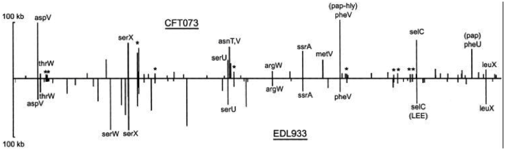
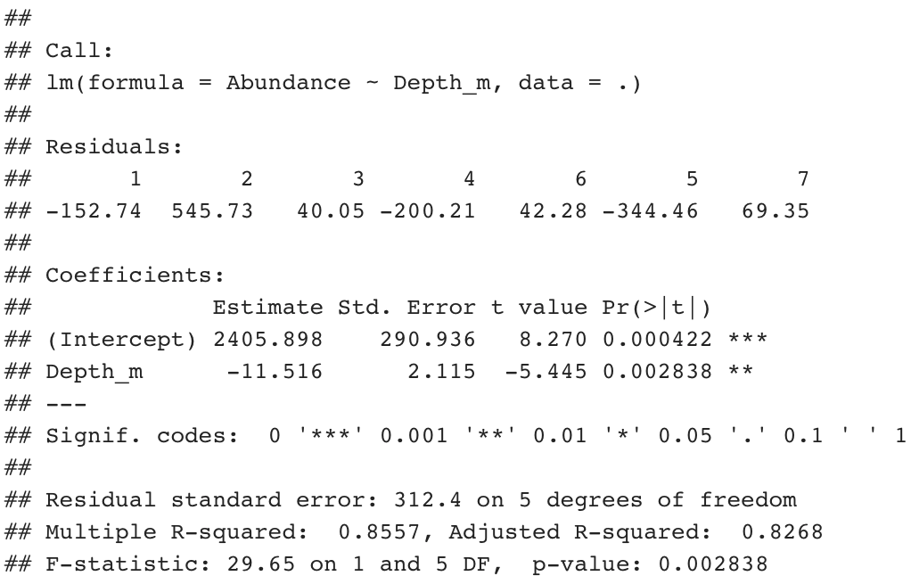
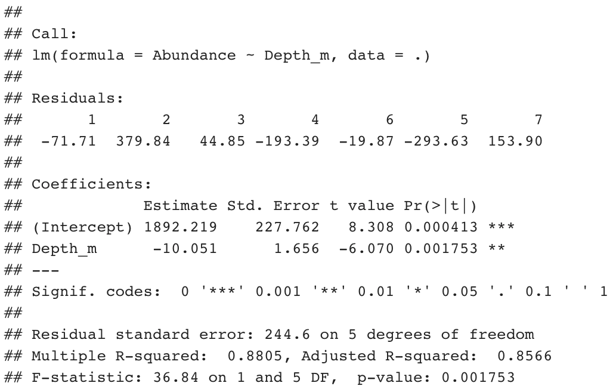
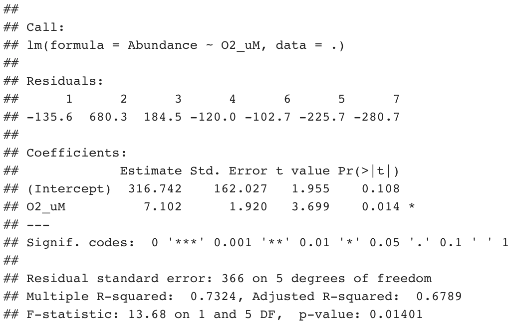
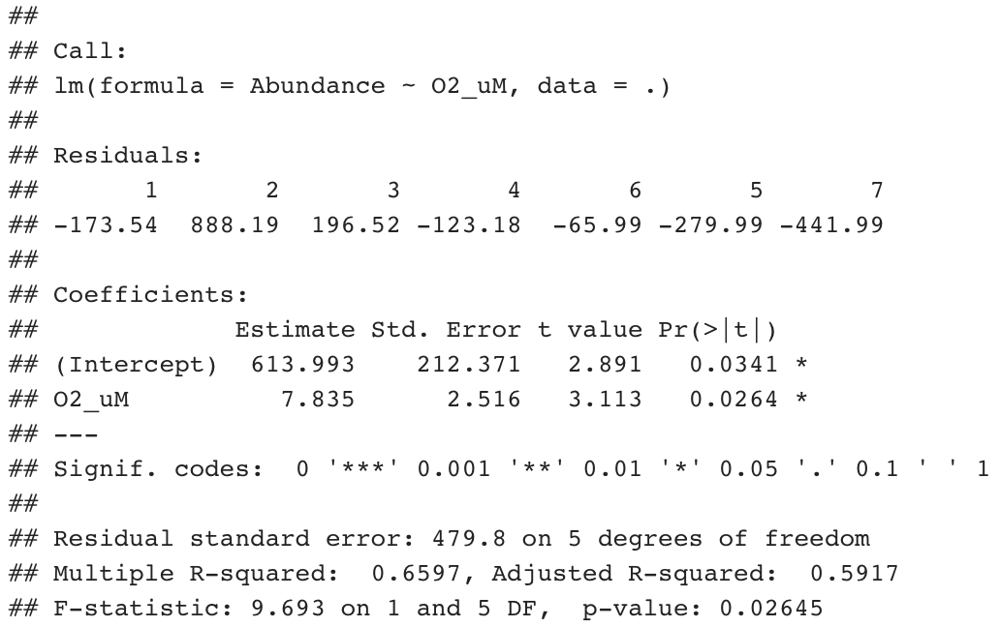
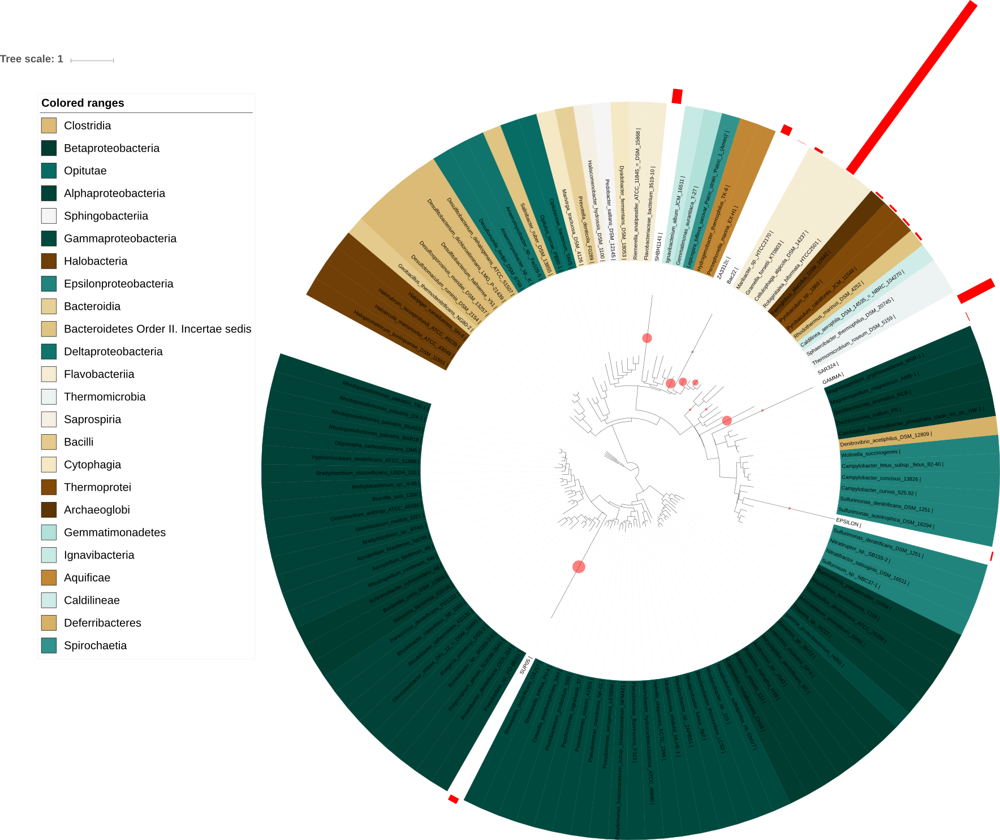
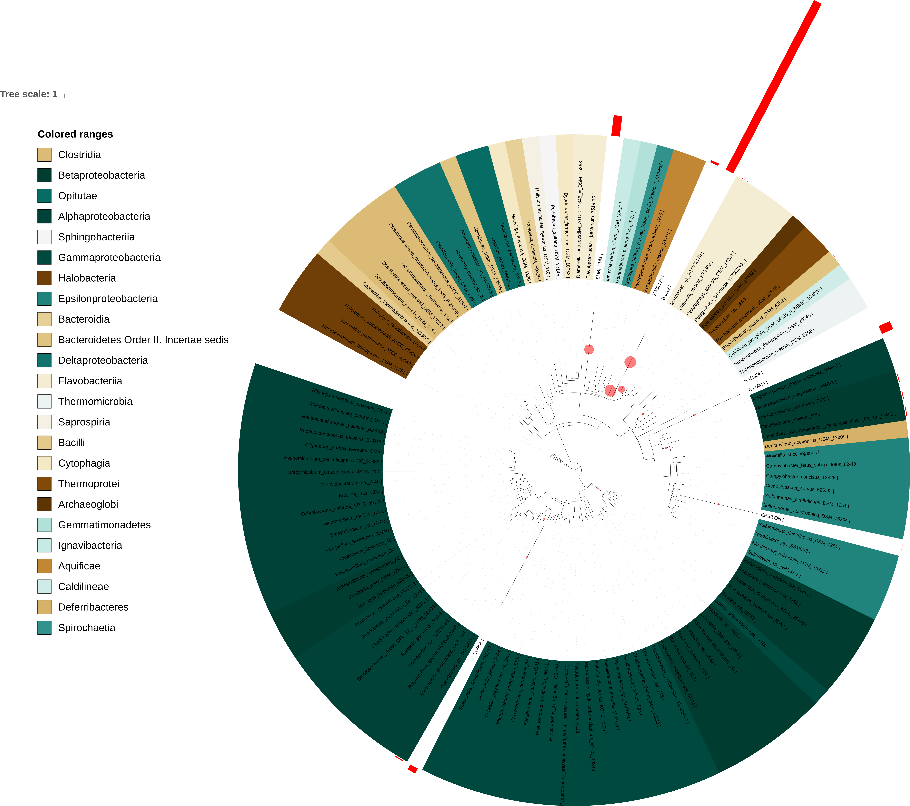

```{r setup, include=FALSE}
knitr::opts_chunk$set(echo = TRUE, fig.width=10, fig.height=10)
library(repr)
library(knitr)
library(tidyverse)
library(cowplot)
library(phyloseq)
library(magrittr)
library(dplyr)
library(ggsn)
library(sf)
```

# Module 01 Portfolio Content

## Evidence Worksheet_01 "Prokaryotes: The Unseen Majority"
**Learning objectives:**  
* Describe the numerical abundance of microbial life in relation to the ecology and biogeochemistry of Earth systems.

**What were the main questions being asked?**  
The number of microbes in the different "compartments" of the Earth - aquatic habitats, soil, marine subsurface, and terrestrial subsurface. 

**What were the primary methodological approaches used?**  
To determine the number of microbes, previous data was used. Samples measuring cell density from each of the compartments were used to determine an average cell denisty. This value (number of bugs/mL) was then multiplied by the volume of the Earth occupied by the compartment.

Due to data limitations, a small number of samples were used to represent each of these compartments, with only three samples used to determine the cell denisty in the subsurface.

**Summarize the main results or findings**  
-Prokaryotes are found in great numbers throughout the different habitats of the Earth (415-640 x 10^28^ cells total), with the largest number found in the subsurface.

-Microbes can be found as far as 4km deep in the subsurface, and up to 57-77km in the atmosphere.

-The number of prokaryotic cells in three other habitats was also calculated: animal guts, the air, and on leaves, but these numbers were orders of magnitude smaller than the other four discussed habitats and thus were not included in the total number of cells.

-There is abundant carbon, nitrogen, and phosphorus contained in microbial biomass, an order of magnitude larger than that contained in plants. Using an average cellular content of carbon, nitrogen, and phosphorus it is estimated that 353-546 Pg of carbon, 85-130 Pg of nitrogen, and 9-14 Pg of phosphorus are contained in prokaryotes.

-By combining the cellular carbon content and amount of carbon available in the different enviornmental compartments, the turnover rates reported from other sources can be verified; the amount of carbon required for cellular synthesis each year cannot exceed the available carbon in each habitat. Using this method, marine and soil numbers were verified, but it was determined that the subsurface biomass may be overestimated.

-Using the turnover time and population in each environmental compartment, prokaryotic genetic diversity was discussed. Using mutation rates (mutations per gene per DNA replication), it can be determined that the rare event of four silumtaneous mutations will occur on a timescale of hours, and five simulatneous mutations will occur every 60 years. Such frequent mutations increase prokaryotic genetic diversity.

**Do new questions arise from the results?**  
The method of cellular density determination was not discussed. Assuming the denisty was determined using a method reliant on cellular culture (such as heterotrophic plate counts, etc), how were accurate numbers determined despite our inability to culture most microbes?

Only three samples were used to determine the cell density for the subsurface, partially due to the difficulty of proper sampling. Are there better methods for sampling now, twenty years later? Have new samples been taken, and have these new data affected the subsurface estimate?

**Were there any specific challenges or advantages in understanding the paper (e.g. did the authors provide sufficient background information to understand experimental logic, were methods explained adequately, were any specific assumptions made, were conclusions justified based on the evidence, were the figures or tables useful and easy to understand)?**  
The paper doesn't provide any error estimates - the possibility of errors is discussed, but there is no error quantification. Additionally, some calculations weren't comprehensively discussed - the calculation for turnover rate includes a multiplier of four, even though the explanation in the paper cites a carbon assimilation efficiency of 20% (so an expected multiplier of five).

## Evidence Worksheet_02 “Life and the Evolution of Earth’s Atmosphere”
**Learning objectives:**   
* Comment on the emergence of microbial life and the evolution of Earth systems
    
    
**Indicate the key events in the evolution of Earth systems at each approximate moment in the time series. If times need to be adjusted or added to the timeline to fully account for the development of Earth systems, please do so.**

    + **4.6 billion years ago**  Solar system formed after local supernova(s)
    
    + **4.5 billion years ago**  Earth is struck, tilting the Earth's spin and ejecting molten material that became the moon
    
    + **4.1 billion years ago**  (Controversial) evidence of life in zircons, surface temperatures ~100C, Earth a steam greenhouse
    
    + **4.0 billion years ago**  Evidence of plate subduction
    
    + **3.8 billion years ago**  Life likely already existed on Earth at this point, evidneced by rocks in Greenland with evidence of deposition (sedimentary rocks); end of meteorite bombardment of Earth, which could have been responsible for bringing life to Earth or possibly spreading life from Earth; possibility of water oceans on Earth
    
    + **3.75 billion years ago**  Methanogenesis occuring; divison of life into bacteria and archaea
    
    + **3.5 billion years ago**  Certain that life present, with claims of first fossil microbial biofilms and stromatolites, and carbonate showing isotopic fractionation, likely due to Rubisco; cyanobacteria exist, likely a chimera of purple and green bacteria, live wherever CO2 and water present and producing oxygen at levels similar to today

    + **3.0 billion years ago**  Stromatolites formed by microbial depositions formed in Steep Rock, Ontario and Pongola Supergroup, South Africa
    
    + **2.7 billion years ago**  Stromatolites, microbial mats, and biofilms found from this period; biological lipids preserved in rocks from Pilbara, Western Australia give evidence for cyanobacteria and eukaryotes
    
    + **2.2 billion years ago**  Sharp increase in atmospheric oxygen, attributed to cyanobacteria; up to this point, there was little evidence of oxidizing conditions with rocks containing typically oxidized materials (detrital pyrite, siderite, and uranite); rocks (redbeds) showing evidence of oxidizing conditions become more widespread after this point

    + **2.1 billion years ago**  First definite evidence of cyanobacteria, via fossils
    
    + **1.5 billion years ago**  Division of eukaryotes into modern plants, fungi, and animals, but likely still single-cell organisms
    
    + **550,000 years ago**  Start of the Phanerozoic era, and the Cambrian explosion 
    
    + **200,000 years ago**  First humans emerge


**Describe the dominant physical and chemical characteristics of Earth systems at the following waypoints:**  

    + **Hadean (4.6 - 4.0 Ga)**  
    Aquatic chemistry dominated by volcanism, making a long lasting primeaval soup unlikely. ROughly one third of the hydrogen contained in the oceans lost to space. Early in ear, Earth still molten, later in the ear either global glaciation with surface heating from meteorite bombardment, or high surface temperatures from greenhouse effeect arising from CO2 rich oceans.
    
    + **Archean (4.0 - 2.5 Ga)** 
    Microbial life diversifying, splitting off into high temperature fermenters and hydrogen users, anoxygenic     photosynthesizers (green and purple), cyanobacteria, sulfer-producing bacteria, methanogens (hyperthermophiles and lower temperatures), and salt-loving archaea. Low amounts of atmospheric oxygen. CO2 and sulfer released by volcanic activity likely sufficient to support chmotrohpic life (CO2, SO4, CH4 and H2S). Earth likely frozen (oceans mostly covered by ice) unless methane atmospheric sontent high enough to produce a greenhouse effect.
    
    + **Precambrian (~2.5 Ga)** 
    Atmospheric oxygen levels rising, leading to oxidizing conditions. As oxygen levels rise, anaerobic microbes are being pushed into smaller environmental niches.
    
    + **Proterozoic (2.5 - 0.5 Ga)** 
    Oxidizing conditions developing, helped along by an early spike in atmospheric oxygen. Widespread oxygenic photosynthesis. Nitrogen fixation develops. Possible there were periods when methane atmospheric content was high, which was then replaced by oxygen.
    
    + **Phanerozoic (0.5 Ma - present day)**  
    The ear of "visible life"; emergence of many new species of animals and plants, both aquatic and terrestrial. Atmospheric oxygen levels rise, which helps spur more life. This era includes Pangea, and physical and chemical characteristics are much the same as today. 
    
## Evidence worksheet_03 "The Anthropocene" via *A safe operating space for humanity*, Rockstrom et al

**Learning objectives:**
* Evaluate huamn impacts on the ecology and biogeochemistry of Earth systems.

**What were the main questions being asked?**
Since the Industrial Revolution, human activity has been changing the environment, and continued disruption will cause dangerous effects for humans. The paper aimed to define which Earth-system processes  help maintain environmental stability, as well as the threshold of these systems within which humans can safely operate. To determine whether we are within safe limits, the current operating level for each of these systems also needed to be defined.

**What were the primary methodological approaches used?**
Used three main branches of science to determine the key Earth-system processes and their safe operation thresholds. The first looks at ecological economics, the capacity of the Earth to support human activity and wellbeing based on biochemical constraints. The second looks at sustainability and changes globally, in relation to human activity and processes of the Earth. The last looks into the capacity of systems to restabilize and sustain through perterbations in the environment with a focus on thresholds and changing states.

**Summarize the main results or findings**
Nine Earth-system processes that help maintain environmental stability:
  1) Climate change  
  2) Rate of biodiversity loss (terrestrial and marine)  
  3) Interference with the nitrogen and phosphorus cycles  
  4) Stratospheric ozone depletion  
  5) Ocean acidification  
  6) Global freshwater use  
  7) Change in land use  
  8) Chemical pollution  
  9) Atmospheric aerosol loading  

We are getting close to the threshold for global freshwater use, change in land use, ocean acidification, and interference with the global phosphorus cycle. We have already surpassed the threshold for climate change, rate of biodiversity loss, and interference with the nitrogen cycle. 

Climate change is defined by atmospheric carbon dioxide concentration, with a threshold of 350 ppmv and a current level of 387 ppmv. Increasing carbon dioxide levels is causing an increase in global temperature, which causes instability of the polar ice sheets and is causing destabilization of other systems.

The Rate of biodiversity loss is quantified by the extinction rate, with a threshold of 10 species per million species per year, and a current level of over 100 species per million species per year. The current extinction rate is the highest it has been since the last global mass-extinction. As biodiversity is lost, ecosystem resilience is lost which in turn affects the safe operating thershold of the other Earth-system processes.

Interference in the nitrogen cycle is quantified by the amount of nitrogen gas removed from the atmosphere for human use, with a threshold of 35 millions of tonnes per year and a current level of 121 millions of tonnes per year. A lot of this manufactured nitrogen ends up in the environment, polluting waterways and incrasing turbidity in lakes, building up in the earth, and releasing gasses including nitrous oxide (an important greenhouse gas) to the environment.

**Do new questions arise from the results?**  
The threshold, current level, and pre-industrial revolution level for atmospheric aerosol loading and chemical pollution are still being determined. There is still a measure of uncertainty for all the system thresholds, particularly that of nitrogen, and these values will become less uncertan as our understanding of these systems and their interactions evolves.

The feedback between the nine Earth system processes isn't fully understood, and a change in one of the Earth processes will affect the behavior and safe operating threshold of the other Earth systems. This will effect the system's safe operating range and the overall behavior in unknown ways. The timescale over which dangerous environmental change and feedback within the systems occurs is also unknown. This is true at all environmental scales, especially globally.

The thresholds for these systems are presented, as well as our current operating level, but it brings up questions of how feasible these thresholds are. For the three system thresholds we have already surpassed, it is hard to get a sense of scale for how much we would need to reduce activty to operate below the thershold. Particularly for nitrogen cycle interference, which we need to reduce to 25% of current production, this is a daunting value. WHat would this actually mean for agriculture and food production? Could we still meet the needs of the global population at this expected level of production? If the detrimental effects from our nitrogen use stem from the release of fertilizers to the environment, rather than the demand on nitrogen gas from our atmosphere, are there methods available to prevent this release? I don't expect this paper to discuss all of these questions, but this is where my mind immediately goes when I read these results.

**Were there any specific challenges or advantages in understanding the paper (e.g. did the authors provide sufficient background information to understand experimental logic, were methods explained adequately, were any specific assumptions made, were conclusions justified based on the evidence, were the figures or tables useful and easy to understand)?**  
The paper didn't include much explanation of methods, or the determination of the nine Earth-system processes that maintain environmental stability. Uncertainties and risks used to determine the thersholds were also mentioned, but were not quantified in any way. There is another resource referenced for their analysis, but when the cited paper was checked the methodology was included in supplementary material that couldn't be found. 

The figure was easy to understand and a good for visualizing threshold vs. current operating level, to see how 'dire' the problem is. I also appreciated that they broke down the problem areas into system processes as well as metrics for those systems. Providing the overall system makes it easier to compartmentalize the issues while still understanding their interconnectedness, as compared to just providing the metrics of interest. 

##Problem Set_01 "Prokaryotes: The unseen majority"

**Learning objectives:**  
Describe the numerical abundance of microbial life in relation to the ecology and biogeochemistry of Earth systems.

**What are the primary prokaryotic habitats on Earth and how do they vary with respect to their capacity to support life? Provide a breakdown of total cell abundance for each primary habitat from the tables provided in the text.**    
Aquatic habitats - contains fewest number of cells, 12 x 10^28^  
Soil- contains the third highest number of cells, 26 x 10^28^   
Marine subsurface- contains the highest numbers of cells, 355 x 10^28^  
Terrestrial subsurface- ontains the second highest number of cells, 25-250 x 10^28^

Each of these environmental compartments contain varying amounts of carbon and other nutrients, affecting their capacity to support life

**What is the estimated prokaryotic cell abundance in the upper 200 m of the ocean and what fraction of this biomass is represented by marine cyanobacterium including Prochlorococcus? What is the significance of this ratio with respect to carbon cycling in the ocean and the atmospheric composition of the Earth?**  
There are 3.6 x 10^28^ cells in the upper 200m of the ocean, at a density of 5 x 10^5^ cells/mL. Autotrophic cyanobacteria, including Prochlorococcus, have a density of 4 x 10^4^ cells/mL.

(4 x 10^4^ autotrophs/mL)/(5 x 10^5^ total cells/mL) = 0.08 = 8% of cells are autotrophic cyanobacteria

These autotrophic cyanobacteria are the microorganisms fixing carbon for the entire ocean, yet they only make up 8% of the population. These microbes control the amount of organic carbon available in the upper 200m of the ocean, which in turn affects the population of the microbes in this environment.

**What is the difference between an autotroph, heterotroph, and a lithotroph?**  
Autotroph - CO2 is the carbon source (fixes inorganic carbon into biomass)  
Heterotroph - Uses organic carbon as the carbon source (assimilates organic carbon into biomass)  
Lithotroph - Uses inorganic compounds (minerals) as the energy source (electron donor)  

**Based on information provided in the text and your knowledge of geography what is the deepest habitat capable of supporting prokaryotic life? What is the primary limiting factor at this depth?**  
Deepest habitat: 14 km below sea level; 4km deep in the ground, below 10 km of water in the Marianas Trench.  
limiting factor: The temperature 4km deep in the ground is 125 Celcius, above which microorganisms can't survive.  

**Based on information provided in the text your knowledge of geography what is the highest habitat capable of supporting prokaryotic life? What is the primary limiting factor at this height?**  
Highest habitat: Microbes (spores, mainly) can be found as high as 57-77 km up in atmosphere, but 20 km is the highest that typically metabolizing microorganisms are found.  
Limiting factor: Lack of nutrients and cold temperatures prevent microbes from being found above these heights. The maximum height at which spores and dead microbes are found is also controlled by their transfer up into the atmosphere, from wind etc.

**Based on estimates of prokaryotic habitat limitation, what is the vertical distance of the Earth’s biosphere measured in km?**  
The range across which microorganisms are found: 14km below sea level + 77km in the atmosphere = 91 km

The range across which microorganisms metabolize: 14 km below sea level + 20 km to the top of everest = 34 km

**How was annual cellular production of prokaryotes described in Table 7 column four determined? (Provide an example of the calculation)**  
To calculate the annual cellular production of prokaryotes, the total number of cells is multiplied by the number of turnovers each year.

Example calculation for Marine heterotrophs:  
(3.6 x 10^28^ cells) x (365 days/yr) x (1/16 day) = 8.21 x 10^29^ cells/year

**What is the relationship between carbon content, carbon assimilation efficiency and turnover rates in the upper 200m of the ocean? Why does this vary with depth in the ocean and between terrestrial and marine habitats?**  
The amount of carbon available in the ocean (and any habitat) will be one of the factors controlling the turnover rate of microbes; if you don’t have the carbon to make another cell, you won’t be making more cells and therefore the turnover will take longer. Additionally, if the carbon-assimilation efficiency is constant (20%), microorganisms with a higher carbon content will need more carbon to duplicate. 

Carbon content decreases with depth. In both the ocean and terrestrial habitats there is less life as you go deeper in the habitats. Plants are on the surface of terrestrail habitats, and most marine life remains in the first few (hundred) meters of the ocean, due to oxygen and sunlight contraints. If there is less other life, there will be fewer carbon sources as you go deeper into these environments, and thus there will be less available carbon. 

Example calculation using Marine heterotrophs above 200m:       
5-20 fg of C/cell, use average 10 fg C/cell = 10 x 10^-30^ Peta grams/cell x 3.6 x 10^28^ cells=    0.36 Pg C in marine heterotrophs x 4 = 1.44 Pg/yr C used
        -where 4 represents the C assimilation efficiency

Roughly 51 Pg C/yr x 85% consumed = 43 Pg C/yr
(43 Pg/yr)/(1.44 Pg/yr C used) = 29.9 turnovers per year  ——> 12.2 days per turnover, close to the 16 day turnover time reported in the paper

**How were the frequency numbers for four simultaneous mutations in shared genes determined for marine heterotrophs and marine autotrophs given an average mutation rate of 4 x 10-7 per DNA replication? (Provide an example of the calculation with units. Hint: cell and generation cancel out)**  
(4 x 10^-7^ mutations/gene/DNA replication)^4^ = 2.56 x 10^-26^ mutations/generation; the power of four comes from having four mutations at once (4 x 10^-7^ = one mutation)

Example calculation for Marine sediments:  
3.6 x 10^28^ cells x (365 days/yr) x (1 turnover/16days) = (8.2 x 10^29^ cells/yr) x (2.56 x 10^-26^ mutations/generation) = 2.1 x 10^4^ mutations/yr = 57.53 mutations/hour

**Given the large population size and high mutation rate of prokaryotic cells, what are the implications with respect to genetic diversity and adaptive potential? Are point mutations the only way in which microbial genomes diversify and adapt?**    
Mutations are one way by which genetic diversiy is created and by which microbes can adapt to new environmental pressures. Not all mutations will result in a successful microorganism, but some will. Mutations have an expected probability of occurring, and using a population size the frequency of mutations ca be determined (as in questions above). Thus, in large populations mutations will occur much more frequently than in small populations, and this is part of what makes mmiicrobes so diverse and easily adaptable. Of course, microbes diversify and adapt via horizontal gene transfer. By sharing genetic information between microbes, "verified" genetic code (genetic code that has been proven to work, unlike mutations) from dissimilar metabolisms and new proteins (etc) can be shared. The microbe may not have an immediate use for the shared genetic code, but given an environmental stress down the line the microbe will be able to express the shard gene to survive.

**What relationships can be inferred between prokaryotic abundance, diversity, and metabolic potential based on the information provided in the text?**    
The more abundant microbes are, the more potential there is for mutation as well as horizontal gene transfer. This leads to genetic diversity, and as microbes diversify they gain (and develop) new matabolic pathways. As more metabolic pathways open to microbes, they will be able to expand into new environmental niches, which leads to microbes being more abundant. It all acts as a cycle, and serves to ensure the continued exsistence of microorganisms.

## Problem Set_02 "Microbial Engines"

**Learning objectives:** Discuss the role of microbial diversity and formation of coupled metabolism in driving global biogeochemical cycles.


**What are the primary geophysical and biogeochemical processes that create and sustain conditions for life on Earth? How do abiotic versus biotic processes vary with respect to matter and energy transformation and how are they interconnected? ** 
Tectonic movement along with photochemical reactions in the atmosphere allow for mixing and partitioning of chemical substrates on Earth. This cycling of nutrients allows a steady supply of substrates (food to sustain life) and the removal of products (which can be toxic, and which continue on through their chemical cycle to again become substrates).

Abiotic processes tend to rely on acid/base reactions, meaning the transfer of protons. Biotic processes rely on redox reactions, which occur using a series of electron and proton transfers from a limited set of substrates. Abiotic and biotic cycles feed into eachother, each cycle using the products as inputs/substrate into their own cycles. This interconnectedness helps maintain these cycles, and prevets substrates on Earth from being transformed completely to end products and depleting substrates required for life.

**Why is Earth’s redox state considered an emergent property?**  
The Earth’s redox state is considered an emergent property because it depends on both geochemical processes and microbial metabolic processes. Depending on geochemical processes, there will be different nutrient niches, which will contain different populations of microbes. As these microbes perform their various metabolic processes, different byproducts will be returned to the environment. Thus, as geochemical cycles and microbial metabolic processes shift and change in an area, the redox state of the Earth also sifts.
 
**How do reversible electron transfer reactions give rise to element and nutrient cycles at different ecological scales? What strategies do microbes use to overcome thermodynamic barriers to reversible electron flow? ** 
Reversible electron transfer reactions give rise to element and nutrient cycles based on different environmental conditions that allow both the forward and reverse reaction to be thermodynamically favorable. As both forward and reverse reaction are favorable under different environmental conditions (substrate availability, products, etc.), a stable nutrient cycle arises. These cycles can be carried out by multiple micoorganisms that are spatially separated, like the nitrogen cycle. Others, like methane formation and oxidation can be carried out by closely related microbes. When it is necessary to overcome thermodynamic barriers, energy (adenosine 5 ́-triphosphate) can be expended (such as in carbon fixation) to do the reverse of energy producing (acetate oxidation to carbon dioxide) reactions.

**Using information provided in the text, describe how the nitrogen cycle partitions between different redox “niches” and microbial groups. Is there a relationship between the nitrogen cycle and climate change?**  
The different stages of the nitrogen cycle all require different amounts of oxygen, corresponding to different redox niches, and the other microbes that will be in that environment. In nitrogen fixation, nitrogen gas is fixed from our atmosphere into ammonium. This is done by nitrogenase, which is inhibited by oxygen, yet this is still done in many microbes in aerobic environments. Nitrification, the oxidation of ammonium to nitrite and finally nitrate, happens in aerobic environments. Denitrification, the anaerobic oxidation of nitrate and nitrite to nitrogen gas, occurs in anoxic/anaerobic environments.
Indirectly, the nitrogen cycle is connected to climate change. All microbes require nitrogen to synthesize protein and nucleic acids, and the only method of nitrogen fixation is via microorganisms. The nitrogen cycle is what controls the amount of available fixed nitrogen, which in turn affects the number of microbes carrying out various other reactions, which in turn produces the Earth’s atmosphere. Additionally, if something were to shift in the nitrogen cycle and affect those microbes involved, it would in turn affect the overall microbial community. The nitrogen cycle does not directly affect climate change, as only nitrogen and hydrogen gas are emitted during nitrogen fixation, nitrification, or denitrification, neither of which are greenhouse gases.

**What is the relationship between microbial diversity and metabolic diversity and how does this relate to the discovery of new protein families from microbial community genomes?**  
Even though microorganisms are exteremely diverse, there still exists a constant set of core genes
that control the predominant redox reactions that play an integral role in life and biogeochemical cycles. So, while microbes themselves are diverse they share many common proteins (etc.) in their metabolism.

Theoretically, there can be limitless evolutionary diversity in nature. We are still discovering unique protein families, in proportion to sampling efforts. As more genomes are sequenced, more protein families are discovered.

**On what basis do the authors consider microbes the guardians of metabolism?**
Horizontal and vertical gene transfer have allowed metabolic pathways to be widespread amoung microbes. Thus, even if an environmental change makes the given metabolic pathway unfavorable, there are other surviving microorganisms containing the genes for the metabolic pathway. The given metabolic pathway may not even be used by the surviving microbe, but given environmental pressures the pathway may again be thermodynamically favorable, and the microorganism can again express the metabolic pathway.

## Writing assessment_01 "Humans as Environmental Stewards"
Microorganisms have been the driving force behind Earth's environment for virtually all of history, controlling the composition of the atmosphere and chemical cycles since life first emerged (1). It is only in recent times, since the Industrial Revolution that humans have had a noticeable effect on the environment. This leads to the question, who should act as steward for the environment and "man the helm of spaceship Earth", the humans or the microbes? Humans are best equipped for the task. Humans are able to engineer nutrient cycles as needed, and more accurately control nutrient allocation; humans have already proven to be capable of causing positive change in our environment, and; humans are better equipped to direct and hasten the abilities of microorganisms, as a tool. Although microorganisms are entrenched in the health and functioning of the environment, the ability of humans to direct our focus and attack individual problems as they arise make us the better caretaker of the Earth.

Humans are able to engineer geochemical cycles and accurately control when and where these nutrients are used. Humans are able to mine for phosphorus, and manufacture liquid ammonia from nitrogen and hydrogen gasses using the Haber-Bosch process (2, 3). This ammonia is then used in fertilizers, to keep up with human agricultural demand, and in various other industrial processes, such as the manufacturing of explosives (4,5). With the invention of chemical fertilizers, humans ability to produce higher yields of crops kept hundreds of thousands from starvation (6). Some may argue that phosphorus reserves are dwindling, and the Haber-Bosch process is energy intensive and requires large quantities of hydrogen gas, preventing this from being sustainable. However, there are other emerging methods of attaining fertilizer through nutrient reclamation. In work currently occurring at UBC, researchers are developing methods for the extraction of struvite (a slow-release fertilizer that contains NH~4~^+^, P, and K) from wastewater (7). This method does not require hydrogen gas, or the high pressures and energy expenditure necessary to the Haber-Bosch process, and precludes the need to mine for phosphorus. Humans' ability to engineer chemical cycles is not restricted to nitrogen and phosphorus. Humans are also capable of producing other nutrients, for example: by mining for iron, producing hydrogen and oxygen via electrolysis of water, and producing biogas for use as an energy source in anaerobic digestion (8, 9, 10). Additionally, by being in control of nutrients, humans can control where to apply these nutrients so that they are apportioned based on need. 
  
Humans have already shown they have the ability to repair undesired shifts in the environment. In 1985, a hole in the ozone layer over the Antarctic was discovered, attributed to the use of chlorofluorocarbons (CFCs). Many nations signed a treaty to eventually stop using CFCs altogether, to heal the hole, and there is now definitive proof that it is working, and is working due to the decline of CFCs (11). Humans have also made numerous changes to technology in response to worsened environmental conditions. Diesel particulate filters on the exhaust pipes of cars minimize the emission of particulate matter, and there are emerging exhaust filters that are able to reduce carbon emissions of CO~2~ and other pollutants like carbon monoxide (12, 13). Humans have made numerous successful changes for the sake of environmental protection.

Humans are also able to skillfully direct the abilities of microorganisms to achieve our own goals, and to do so on timescales relevant to humans and other multi-cellular life. There are many situations in which microorganisms can clean a polluted area, with the addition nutrients. There are microorganisms that have the ability to clean oil spills, i.e. consume hydrocarbons, but the rate of consumption depends on the size of the oil droplets, and sufficient nutrients for sustained life (bioavailable nitrogen and phosphorus). With human assistance to provide these necessary conditions, the timeframe of oil spill cleanup accelerates (14). Bioremediation of terrestrial sites follows a similar pattern: nutrients and other environmental conditions are provided for and created, to accelerate the rate of microbial consumption. Such methods are used for Superfund Sites in the United State, using injection wells to provide oxygen, nutrients, etc. to deep sediments (15). Humans also harness the abilities of microorganisms via wastewater treatment. By (most often) providing oxygen during biologically activated processes, microorganisms consume the incoming waste (16). If raw waste were to be released to the environment, it would still be degraded by microorganisms, to a degree, but the dissolved oxygen of the receiving water body would also be consumed, which leads to anoxic zones and environmental degradation (16). The guidance of humans allows microorganisms to become an effective another tool, rather than mindless engines.

Humans are the best-equipped caretakers of Earth. Humans can intervene on nutrient cycles as is necessary, have previously demonstrated an ability to change environmental imbalances for the better, and are better able to make use of the ability of microorganisms for environmental remediation. Microorganisms have been the driving force behind Earth's environment for virtually all of history, and its time they step aside.

**References**

1. Nisbet EG, Sleep NH. 2001. The habitat and nature of early life. Nature. **409**:1083-1091.
The Microbial Engines That Drive Earth's Biogeochemical Cycles. Science. 320:1034-1039.

2. [Vella H. 2016. What's shaping the future of phosphorus?. Mining Technology. Online. ](https://www.mining-technology.com/features/featurephosphorus-whats-shaping-the-future-of-this-vital-element-4913074/)

3. [Clark J. 2013. The Haber Process. ChemGuide. Online.](https://www.chemguide.co.uk/physical/equilibria/haber.html)

4. [McKenzie R. 1998. Crop nutrition and fertilizer requirements. Alberta Agricuture and Forestry. Online.](https://www1.agric.gov.ab.ca/$department/deptdocs.nsf/all/agdex3791)

5. [PubChem, Open Chemistry Database. 2018. Ammonium Nitrate, Compound Summary for CID 22985. National Center for Biotechnology Information. Online.](https://pubchem.ncbi.nlm.nih.gov/compound/ammonium_nitrate)

6. [Hazell, Peter B.R. (2009). The Asian Green Revolution. IFPRI Discussion Paper. International Food Policy Research Institute. GGKEY:HS2UT4LADZD.](https://books.google.ca/books?id=frNfVx-KZOcC&pg=PA1&redir_esc=y#v=onepage&q&f=false)

7. [Disha AZ. 2018. Nitrogen recovery from municipal wastewater through newberyite to struvite crystallization process. MaSc. UBC. University of British Columbia, Vancouver, BC.](https://open.library.ubc.ca/cIRcle/collections/ubctheses/24/items/1.0364400)

8. [Basov V. 2015. True giants of mining:World's top 10 iron ore mines. Mining.com. Online.](http://www.mining.com/true-giants-of-mining-worlds-top-10-iron-ore-mines/)

9. [Sandru O. 2018. Hydrogen from water - 3 production methods. The Green Optimist. Online.](https://www.greenoptimistic.com/hydrogen-from-water/)

10. [Pennsylvania State. 2018. Anaerobic Digestion:Biogas production and odor reduction. PennState Extension. Online.](https://extension.psu.edu/anaerobic-digestion-biogas-production-and-odor-reduction)

11. [Reiny S. 2018. NASA Study: First direct proof of ozone hole recovery due to chemicals ban. NASA. Online.](https://www.nasa.gov/feature/goddard/2018/nasa-study-first-direct-proof-of-ozone-hole-recovery-due-to-chemicals-ban)

12. [RAC.2018. Dielsel particulate filters:what you need to know. RAC Drive. Online.](https://www.rac.co.uk/drive/advice/emissions/diesel-particulate-filters/)

13. [Campos M.2011. Exhaust filter cuts harmful particles and emissions. Luxury Coach and  Transportation. Online.](https://www.lctmag.com/news/40081/exhaust-filter-cuts-harmful-particles-and-emissions)

14. [Biello D., 2010](https://www.scientificamerican.com/article/how-microbes-clean-up-oil-spills/)

15. [United States Environmental Protection Agency, 2001](https://www.epa.gov/sites/production/files/2015-08/documents/bioremediation_542r01019.pdf)

16. Metcalf Eddy. 1972. Wastewater Engineering: Treatment/Disposal/Reuse. McGraw Hill. Second Edition.

# Module 02 Portfolio Content

## Evidence worksheet_04 “Bacterial Rhodopsin Gene Expression”
**Learning objectives:**
* Discuss the relationship between microbial community structure and metabolic diversity

*	Evaluate common methods for studying the diversity of microbial communities

*	Recognize basic design elements in metagenomic workflows

**General Questions**

**What were the main questions being asked?**  
-What is the purpose of Proteorhodopsin, and what genes are required for full functionality, as well as which of these genes are already present in E. coli?  
-How is Proteorhodopsin inhibited via the proton pump?  
-What are the similarities between existing strains and the studied mutated E. coli?  

**What were the primary methodological approaches used?**  
*-Fosmid library*  
Used to screen for the genes associated with Proteorhodopsins

*-Screening for PR expression*  
Used high-density colony macroarray and visually detected color (red/orange). If color was present, representing a positive result, the fosmid DNA was transfered to E coli. and then rechecked to make sure the color was conferred by the fosmid.

*-In vitro transposition and full fosmid sequencing*  
Done using the EZ-Tn5 kan-2 insertion kit.The transposition reaction was carried out by electroporation into EPI300 cells, and selecting those clones that contained fosmids with insertions. LB plates were used to analyze the color phenotype of the individual clone instertions. DNA sequencing was performed, with the complete DNA sequence assembled via Sequencher version 4.5, and annotated using FGENSB and Artemis version 6.

*-Cartenoid extractions*  
Overnight cultures were diluted and incubated with shaking. At that point, L-arabinose was added and cultures were further incubated for another 16 h. Cells were harvested, rinsed, and frozen at 20°C in the dark. Using sonication, frozen cells were extracted, and then centrifuged to form a pellet. The supernatant was further filtered, and extracts concentrated by evaporation under dry nitrogen gas. The steps for extraction were carried out in darkness or low-light to keep carotenoid photooxidation to a minimum.

*-HPLC Analysis*  
Used high-performance liquid chromatography to analyze carotenoids; identified cartenoids through comparison of measured absorbance spectra and retention times with verified standards

*-Proton pumping experiments (and inhibition)*  
Two millimeter cell suspension was placed in a photosynthetic chamber and kept at 22°C.

*-ATP measurements*  
ATP concentration was measured with a luciferase-based assay, using samples taken at every timestep. 

**Summarize the main results or findings**  
-The comprehensive collections of genes necessary for the PR-associated retinal biosynthesis and light-activated proton translocation and photophosphorylation in E. coli is: crtE, for putative geranylgeranyl pyrophosphate (GGPP) synthase; crtI, for phytoene dehydrogenase; crtB, phytoene synthase; crtY, lycopene cyclase; blh, 15,15 - - carotene dioxygenase; and idi, isopentenyl diphosphate (IPP) del-isomerase  

-HF10_19P19 and HF10_25F10 independently express a functional PR with light- activated proton-translocating activity  

-The idi gene wasn't required for full function: E. coli already have the ability to encode IPP-isomerase, the function provided by idi  

-metagenomic libraries can be used to screen large-insert DNA for new phenotypes and activities directly and without subcloning  

-The genes necessary for phototrophic capabilities can be passed on with a single lateral transfer, hence the widespread capability in nature, particularly planktonic marine micoorganimsms. The only prerequisite is the ability to synthesize FPP, a common biosynthesis intermediary  

-In low respiratory conditions, the H^+^-ATP synthase acts as an ATPase, driving proton movement to maintain the proton-motive force and hydrolize ATP

**Do new questions arise from the results?**  
-The reason for a lack of orange color and low levels of retinal when the PR gene is disrupted with transposon insertions; is it due to pathway inhibition from product accumulation, polar effect due to transposon insertion in downstream expression, or some mechanism not previously considered  

-There has not yet been a conclusive connection between light stimulation and growth rate; in studies using natural seawater incubations as well as PR-containing isolates, no enhanced growth was detected in the presence of light. In another study using PR-expressing marine flavobacterium, a significant enhancement of growth rate was found, but was not conclusively linked to PR

**Were there any specific challenges or advantages in understanding the paper (e.g. did the authors provide sufficient background information to understand experimental logic, were methods explained adequately, were any specific assumptions made, were conclusions justified based on the evidence, were the figures or tables useful and easy to understand)?**  
-Provided good background on the PR, and the function of the genes involved

-The authors write for an audience with a background knowledge of genetic manipulation, as well as the understood competitive advantage of a light-activated proton pump for ATP synthesis

## Problem Set_03 "Metagenomics: Genomic Analysis of Microbial Communities"
**Learning objectives: **
Specific emphasis should be placed on the process used to find the answer. Be as comprehensive as possible e.g. provide URLs for web sources, literature citations, etc.  

**How many prokaryotic divisions have been described and how many have no cultured representatives (microbial dark matter)?**  
-As of 2016, 89 bacterial phyla, 20 archael phyla. There are likely up to 1500 bac phyla (many in the "shadow biosphere", which we can't culture to use to determine the actual number of phyla) [(1)](https://www.sciencedirect.com/science/article/pii/S1369527416300558)

-As of 2003, 52 major bacterial phyla and only 26 had been sequenced [(2)](https://www.ncbi.nlm.nih.gov/pubmed/14527284)

--Things are changing quickly and we are constantly making new discoveries, making an exact number unrealistic

**How many metagenome sequencing projects are currently available in the public domain and what types of environments are they sourced from?**  
-On the EBI database 1501 projects and 87419 samples public; EBI is only one of many sites on which such datasets are available [(3)](https://www.ebi.ac.uk/metagenomics/)

-NIH, the human microbiome project [(4)](https://www.hmpdacc.org/resources/data_browser.php)

--There are an uncountable number available from all sorts of environments

**What types of on-line resources are available for warehousing and/or analyzing environmental sequence information (provide names, URLS and applications)?**   
Numerous resources, non-exhaustive list of 12 metagenomics resources here [(5)](https://www.sciencedirect.com/science/article/pii/S1672022915001424)

*[MG-RAST](https://metagenomics.anl.gov/)*
Multiple pipelines available, online storage available with 215,773 metagenome dataset and 30,589 public metagenomes

*[IMG/M](http://img.jgi.doe.gov/m)*	
Multiple pipelines available, online storage available with	32,802 genome and 5234 metagenome dataset

*[METAREP](http://jcvi.org/metarep/)*	
Multiple pipelines available, no online storage

*[CoMet](http://comet.gobics.de/)*	
Multiple pipelines available, no storage

*[METAGENassist](http://www.metagenassist.ca/METAGENassist/)*	
Multiple pipelines available, no storage

*[MetaABC](http://metaabc.iis.sinica.edu.tw/)*	
Database of reference genomes with 52 datasets online

*[MyTaxa](http://enve-omics.ce.gatech.edu/mytaxa/)*
Database of reference genes and genomes (NCBI), no storage

*[metaMicrobesOnline](http://meta.microbesonline.org/)*
Multiple pipelines available, online storage available with 155 metagenome and 3527 genome dataset

*[EBI Metagenomics](https://www.ebi.ac.uk/metagenomics/)*
Multiple pipelines available, online storage available with 141 projects and 5800 dataset

*[CAMERA](http://camera.calit2.net/)*
Multiple pipelines available, online storage available with	128 projects and 2660 samples

*[METAVIR](http://metavir-meb.univ-bpclermont.fr/)*
Multiple pipelines available, online storage available with	170 viral metagenomic dataset and 335 projects

*[VIROME](http://virome.dbi.udel.edu/)*
Multiple pipelines available, online storage available with	466 libraries containing 24,386,816 reads

**What is the difference between phylogenetic and functional gene anchors and how can they be used in metagenome analysis?**

* Phylogenetic gene anchor:  
    * Based on passinng of genes to daughter cells (vertical gene transfer)  
    * Can be used to determine phylogenetic info, reconstruct trees  

* Functional gene anchors:  
    * Based on functions encoded in genes  
        + function may have been confered via vertical gene transfer **or**   
        + from  non-phylogenetically linked microbe via horizontal gene transfer    
    *  Can use to make inferences on hiabitat/redox conditions, involvement in chemical cycles
    
 *  Based on: [(6)](https://www.ncbi.nlm.nih.gov/pmc/articles/PMC539003/)

**What is metagenomic sequence binning? What types of algorithmic approaches are used to produce sequence bins? What are some risks and opportunities associated with using sequence bins for metabolic reconstruction of uncultivated microorganisms?**    

* Binning: grouping reads or contigs and assigning OTUs [(7)](https://doi.org/10.1093%2Fbib%2Fbbs054) 
* Binning algorithms either [(8)](https://doi.org/10.1073%2Fpnas.91.26.12837):
    + Use previously determined sequences (supervised classifiers) 
        + Can perform alignments against databases, try to separate using organism-specific characteristics of the DNA 
            + ex. GC content, codon usage
    + Try to find new groups (unsupervised classifiers) 
    
* Risks [(9)](https://academic.oup.com/bib/article/13/6/669/193900):
    + Primarily, query sequences originating from the genomes of most microbes in an environmental sample lack taxonomically related sequences in existing reference databases. 
    + Sequencing platform limitations (currently improving)
        + Short read lengths, sequencing errors/artifacts
        + Size of metagenomic dataset, need for efficient algorithms

* Opportunities: 
    + Learn new info
    + Track species evolution

**Is there an alternative to metagenomic shotgun sequencing that can be used to access the metabolic potential of uncultivated microorganisms? What are some risks and opportunities associated with this alternative?**      
Few, one example provided here: 

* Single cell genomics [(10)](https://www.sciencedirect.com/science/article/pii/S1369527412001166):
    + Know you are sequencing cell of interest, full picture its functions, etc.
    + Amplication bias, allelic dropouts and preferential allelic amplification, nucleotide copy errors, etc. [(11)](http://journals.plos.org/plosgenetics/article?id=10.1371/journal.pgen.1004126)

# Module 03 Portfolio Content

## Evidence worksheet_05 "Extensive mosaic structure" 

**Part 1 Learning objectives:**

* Evaluate the concept of microbial species based on environmental surveys and cultivation studies.

* Explain the relationship between microdiversity, genomic diversity and metabolic potential

* Comment on the forces mediating divergence and cohesion in natural microbial communities


**General Questions**

**What were the main questions being asked?**  
-What are the differences between three strains of E. coli, two uropathogenic and one non-pathogenic?  
-What is the genetic and OTU similarity between the pathogenic and non-pathogenic strains?  
-How conserved are genes associated with pathogenicity/PAIs?  
-What is the effect of lateral gene transfer on the emergence of uropathogenic E. coli strains?

**What were the primary methodological approaches used?**  
*-For clones and sequencing:*  
Used pBluescript and M13Janus to prepare whole-genome libraries using genomic DNA. Data are collected from Applied Biosystem ABI377 and 3700n automated seqeuncers. SEQMANII is used to assemble sequence data. Primer walking and PCR-based analysis are used to finish sequencing opposite ends of linking clones. XhoI optical map of whole genome is used to order contigs and confirm contig structure, and act as a map of the whole genome.

*-Sequence analysis and annotation:*  
Annotated genome sequence in MAGPIE, defined ORFs in GLIMMER. BLAST is used to search for predicted proteins

*-Shotgun sequencing and PCR:*  
Used 90% identity match of CFT073 in either MG1655 or EDL933, 90% of both genes in alignments, and lack of equivalent match in other location in CFT073 genome used to infer orthology.

**Summarize the main results or findings**   
-The CFT073 genome is circular, with a 5 million-bp chromosomal sequence with seven times coverage.  

-There is selective pressure to conserve PAI in infection and host colonization 

-The genetic backbone is evolutionarily conserved among different strains through vertical gene transfer 

-The location of specific regions for insertion of infectious genes are conserved, but the specificity to genes is not necessarily conserved  

-There is great genetic diversity between PAIs of pathogenic/pathogenic strains, and pathogenic/non-pathogenic strains  

-Each type/species of E. coli possesses combinations of island genes that confer its characteristic lifestyle or its pathogenicity. For example, the uropathogenic strain CFT073 acquired an island gene that allows it to infect the urinary tract and bloodstream without compromising its ability to colonize the intestine.

-The net result of the evolution of different strains is a mosaic genome sturcture made of the newly acquired genes within the framework of E. coli's backbone genes that are used to distinguish E. coli from other close relatives

**Do new questions arise from the results?**  
-How do pathogenic E. coli compare with other pathogens, such as Shigella and Y. pestis?   
-How can a defeinition of species be defined that accounts for the frequent loss/gain of accessory genes. Simple definitions based on phenotypic analysis and low resolution mapping don't provide a full picture  

-Why isn't there evidence of genome consolidation even though E. coli has a commensal relationship, living in animal's intestines, a nutrient rich environment, for millions of years?

**Were there any specific challenges or advantages in understanding the paper (e.g. did the authors provide sufficient background information to understand experimental logic, were methods explained adequately, were any specific assumptions made, were conclusions justified based on the evidence, were the figures or tables useful and easy to understand)?**   
-The paper was written for an audience with prior knowledge of E. coli genomics and genetics; background on gene functions and locations not provided, and selective pressures leading to the retention of rare codons (etc.) were not discussed

**Part 2 Learning objectives:**

* Comment on the creative tension between gene loss, duplication and acquisition as it relates to microbial genome evolution

* Identify common molecular signatures used to infer genomic identity and cohesion

* Differentiate between mobile elements and different modes of gene transfer


**Based on your reading and discussion notes, explain the meaning and content of the following figure derived from the comparative genomic analysis of three E. coli genomes by Welch et al. Remember that CFT073 is a uropathogenic strain and that EDL933 is an enterohemorrhagic strain. Explain how this study relates to your understanding of ecotype diversity. Provide a definition of ecotype in the context of the human body. Explain why certain subsets of genes in CFT073 provide adaptive traits under your ecological model and speculate on their mode of vertical descent or gene transfer.**



This figure shows the mosaic structure of the different strains: the backbone of the E. coli genome is largely conserved, with larger islands occuring in the same locations for both strains (aspV, thrW, pheV, leuX, etc). There are other shorter islands for both strains, providing those functions that allow the starin to adapt the its specific environment.

The study helps illustrate how wide a range of functions can be contained within the same ecotype; only 39.2% of proteins are shared amoung all three of the strains of E. coli used in this study. All three strains occupy seemingly similar environments (inside animals) yet have become highly specialized with different functions and low simialrities in protein production.

Ecotype in the context of the human body: skin and hair colour varies with global region; microbiota in digestive system are based on diet; different pathogen immunities based on exposure, determined by region (ex. smallpox when collonizing the Americas); different tissues types; each type of human cell has different receptors, secretions, and surroundings that make up the extracellular environment

CFT073 is uropathogenic, and certain subsets of its genes allow adaptation to the urinary tract (over the digestive track, etc.). These adaptations allow CFT073 to thrive in among the different tissue types and the different environment of the urinary tract, compared to other strains of E. coli. This is likely of horizontal gene transfer.

## Problem set_04 “Fine-scale phylogenetic architecture”
**Learning objectives:**

* Gain experience estimating diversity within a hypothetical microbial community

### Part 1: Description and enumeration
Obtain a collection of "microbial" cells from "seawater". The cells were concentrated from different depth intervals by a marine microbiologist travelling along the Line-P transect in the northeast subarctic Pacific Ocean off the coast of Vancouver Island British Columbia. 

Sort out and identify different microbial "species" based on shared properties or traits. Record your data in this Rmarkdown using the example data as a guide.

Once you have defined your binning criteria, separate the cells using the sampling bags provided. These operational taxonomic units (OTUs) will be considered separate "species". This problem set is based on content available at [What is Biodiversity](http://cnx.org/content/m12179/latest/).

For example, load in the packages you will use.
```{r, include=FALSE}
library(kableExtra)
library(knitr)
library(tidyverse)
library(vegan)
```

**For the original community**
```{r, eval=TRUE, echo=FALSE, message=FALSE, warning=FALSE}
example_data1 = data.frame(
  number = c( 1, 2, 3, 4, 5, 6, 7, 8, 9, 10, 11, 12, 13, 14, 15),
  name = c("Hershey's", "M&Ms", "Coated Bears", "Classic Bears", "Strings", "Wine Gummies", "Strawberry", "Swirl", "Octopi", "Soda Bottles", "Watermelon", "Jolly Ranchers", "Spheres", "Lego", "Skittles"),
  characteristics = c("chocolate kiss", "candy-covered chocolate", "coated bear soft gummy", "bear soft gummy", "long strings, soft matte gummy", "oblong soft matte gummy", "strawberry sugar-coated gummy", "swirly sugar-coated gummy", "octopi sugar-coated gummy", "bottle sugar-coated gummy", "watermelon sugar-coated gummy", "hard oblong gummy", "hard spherical gummy", "bricks of crunchy sugar", "elliptical crunchy sugar"),
  occurences = c(16, 214, 3, 101, 14, 8, 1, 3, 6, 3, 2, 131, 19, 17, 197)
)

example_data1 %>% 
  kable("html") %>%
  kable_styling(bootstrap_options = "basic", font_size = 10, full_width = F)
```
	
**For my sample of the original community:**
```{r, eval=TRUE, echo=FALSE, message=FALSE, warning=FALSE}
example_data1_subsample = data.frame(
  number = c( 1, 2, 3, 4, 5, 6, 7, 8, 9, 10),
  name = c("Hershey's", "M&Ms", "Classic Bears", "Wine Gummies", "Swirl", "Soda Bottles", "Jolly Ranchers", "Spheres", "Lego", "Skittles"),
  characteristics = c("chocolate kiss", "candy-covered chocolate", "bear soft gummy", "oblong soft matte gummy", "swirly sugar-coated gummy", "bottle sugar-coated gummy", "hard oblong gummy", "hard spherical gummy", "bricks of crunchy sugar", "elliptical crunchy sugar"),
  occurences = c(3, 52, 23, 2, 1, 1, 36, 5, 7, 43)
)

example_data1_subsample %>% 
  kable("html") %>%
  kable_styling(bootstrap_options = "basic", font_size = 10, full_width = F)
```

**Is your collection of microbial cells from seawater representative of the actual diversity of microorganisms inhabiting waters along the Line-P transect? Were the majority of different species sampled or were many missed?**
The diversity is much lower than the original sample, with only 2/3 of the original species represented in my community sample. Those species that were missed were either part of the "rare biome" (things like coated bears, strawberry, octopi, and watermelon) while the other missing species was on the rare side and also tangled together into a "biofilm" rather than existing as a more easily separatable cell.
 
 
### Part 2: Collector's curve
To help answer the questions raised in Part 1, you will conduct a simple but informative analysis that is a standard practice in biodiversity surveys. This analysis involves constructing a collector's curve that plots the cumulative number of species observed along the y-axis and the cumulative number of individuals classified along the x-axis. This curve is an increasing function with a slope that will decrease as more individuals are classified and as fewer species remain to be identified. If sampling stops while the curve is still rapidly increasing then this indicates that sampling is incomplete and many species remain undetected. Alternatively, if the slope of the curve reaches zero (flattens out), sampling is likely more than adequate.

To construct the curve for your samples, choose a cell within the collection at random. This will be your first data point, such that X = 1 and Y = 1. Next, move consistently in any direction to a new cell and record whether it is different from the first. In this step X = 2, but Y may remain 1 or change to 2 if the individual represents a new species. Repeat this process until you have proceeded through all cells in your collection.

**For my sample:**
```{r, eval=TRUE, echo=FALSE, message=FALSE, warning=FALSE}
example_data2 = data.frame(
  x = c(1,2,3,4,5,6,7,8,9,10,11,12,13,14,15,16,17,18,19,20,21,22,23,24,25,26,27,28,29,30,31,32,33,34,35,36,37,38,39,40,41,42,43,44,45,46,47,48,49,50,51,52,53,54,55,56,57,58,59,60,61,62,63,64,65,66,67,68,69,70,71,72,73,74,75,76,77,78,79,80,81,82,83,84,85,86,87,88,89,90,91,92,93,94,95,96,97,98,99,100,101,102,103,104,105,106,107,108,109,110,111,112,113,114,115,116,117,118,119,120,121,122,123,124,125,126,127,128,129,130,131,132,133,134,135,136,137,138,139,140,141,142,143,144,145,146,147,148,149,150,151,152,153,154,155,156,157,158,159,160,161,162,163,164,165,166,167,168,169,170,171,172,173),
  y = c(1,2,3,4,4,4,4,4,4,4,4,4,5,5,5,5,5,5,5,5,5,5,5,5,5,5,5,5,5,5,5,5,5,5,5,5,5,5,6,6,6,6,6,6,6,6,6,6,6,6,6,6,6,6,7,7,7,7,7,7,7,8,8,8,8,8,8,8,8,8,8,8,9,9,9,9,9,9,9,9,9,9,9,9,9,9,9,9,9,9,9,9,9,9,9,9,9,9,9,10,10,10,10,10,10,10,10,10,10,10,10,10,10,10,10,10,10,10,10,10,10,10,10,10,10,10,10,10,10,10,10,10,10,10,10,10,10,10,10,10,10,10,10,10,10,10,10,10,10,10,10,10,10,10,10,10,10,10,10,10,10,10,10,10,10,10,10,10,10,10,10,10,10)
)

ggplot(example_data2, aes(x=x, y=y)) +
  geom_point() +
  geom_smooth() +
  labs(x="Cumulative number of individuals classified", y="Cumulative number of species observed")
```

**Does the curve flatten out? If so, after how many individual cells have been collected?**
The curve roughly flattens out after ~82 individual cells have been collected. This is roughly half of the total number of cells (173).

**What can you conclude from the shape of your collector's curve as to your depth of sampling?**
As my collector's curve becomes roughly flat, its safe to say that the sampling depth was adaquate, so that the sample was representative of the original community.

### Part 3: Diversity estimates (alpha diversity)
Using the table from Part 1, calculate species diversity using the following indices or metrics.

#### Diversity: Simpson Reciprocal Index

$\frac{1}{D}$ where $D = \sum p_i^2$

$p_i$ = the fractional abundance of the $i^{th}$ species

**For the original community**
```{r, eval=TRUE, echo=FALSE, message=FALSE, warning=FALSE}
species1 = (16/(16+214+3+101+14+8+1+3+6+3+2+131+19+17+197))
species2 = (214/(16+214+3+101+14+8+1+3+6+3+2+131+19+17+197))
species3 = (3/(16+214+3+101+14+8+1+3+6+3+2+131+19+17+197))
species4 = (101/(16+214+3+101+14+8+1+3+6+3+2+131+19+17+197))
species5 = (14/(16+214+3+101+14+8+1+3+6+3+2+131+19+17+197))
species6 = (8/(16+214+3+101+14+8+1+3+6+3+2+131+19+17+197))
species7 = (1/(16+214+3+101+14+8+1+3+6+3+2+131+19+17+197))
species8 = (3/(16+214+3+101+14+8+1+3+6+3+2+131+19+17+197))
species9 = (6/(16+214+3+101+14+8+1+3+6+3+2+131+19+17+197))
species10 = (3/(16+214+3+101+14+8+1+3+6+3+2+131+19+17+197))
species11 = (2/(16+214+3+101+14+8+1+3+6+3+2+131+19+17+197))
species12 = (131/(16+214+3+101+14+8+1+3+6+3+2+131+19+17+197))
species13 = (19/(16+214+3+101+14+8+1+3+6+3+2+131+19+17+197))
species14 = (17/(16+214+3+101+14+8+1+3+6+3+2+131+19+17+197))
species15 = (197/(16+214+3+101+14+8+1+3+6+3+2+131+19+17+197))

1 / ((species1^2) + (species2^2) + (species3^2) + (species4^2) + (species5^2) + (species6^2) + (species7^2) + (species8^2) + (species9^2) + (species10^2) + (species11^2) + (species12^2) + (species13^2) + (species14^2) + (species15^2))
```

**For my sample of the original community**
```{r, eval=TRUE, echo=FALSE, message=FALSE, warning=FALSE}
#For my subsample
species01 = (5/(173))
species02 = (7/(173))
species03 = (1/(173))
species04 = (3/(173))
species05 = (1/(173))
species06 = (2/(173))
species07 = (23/(173))
species08 = (36/(173))
species09 = (43/(173))
species010 = (52/(173))

1 / ((species01^2) + (species02^2) + (species03^2) + (species04^2) + (species05^2) + (species06^2) + (species07^2) + (species08^2) + (species09^2) + (species010^2))
```

The higher the value is, the greater the diversity. The maximum value is the number of species in the sample, which occurs when all species contain an equal number of individuals. Because the index reflects the number of species present (richness) and the relative proportions of each species with a community (evenness), this metric is a diveristy metric. Consider that a community can have the same number of species (equal richness) but manifest a skewed distribution in the proportion of each species (unequal evenness), which would result in different diveristy values.

**What is the Simpson Reciprocal Index for your sample?**
The Simpson Reciprocal Index for my sample is 4.628, which is a moderate value (maximum value is 10). So the sample was moderately diverse.

**What is the Simpson Reciprocal Index for your original total community?**
The Simpson Reciprocal Index for the original community is 4.772, which is on the low side (maximum value is 15), and very close to the Simpson Reciprocal Index for my sample from this original community. This implies that the diversity of the original community (and therefore my sample from the original community) is dominated by those species found in high quantities - the rare species of which there are few, like Watermelon and Strawberry, do not have much impact on diversity.

#### Richness: Chao1 richness estimator
Another way to calculate diversity is to estimate the number of species that are present in a sample based on the empirical data to give an upper boundary of the richness of a sample. Here, we use the Chao1 richness estimator. 

$S_{chao1} = S_{obs} + \frac{a^2}{2b})$

$S_{obs}$ = total number of species observed
a = species observed once
b = species observed twice or more

**So the $S_{chao1}$ for my sample of the original community is:**

```{r}
#$S_{obs}$ = 10
#a = 2
#b = 8

10 + ((2^2)/(2*8))
```

**So the $S_{chao1}$ for the original community is:**

```{r}
#$S_{obs}$ = 15
#a = 2
#b = 13

15 + ((2^2)/(2*13))
```

### Part 4: Alpha-diversity functions in R
We've been doing the above calculations by hand, which is a very good exercise to aid in understanding the math behind these estimates. Not surprisingly, these same calculations can be done with R functions. Since we just have a species table, we will use the `vegan` package. You will need to install this package if you have not done so previously. 

**What are the Simpson Reciprocal Indices for your sample and community using the R function?**

**For the original community**
```{r, eval=TRUE, echo=FALSE, message=FALSE, warning=FALSE}
example_data1_diversity = 
  example_data1 %>% 
  select(name, occurences) %>% 
  spread(name, occurences)

example_data1_diversity
#Then, we can calculate the Simpson Reciprocal Index using the `diversity` function.
diversity(example_data1_diversity, index="invsimpson")
```

**For my sample of the original community**
```{r, eval=TRUE, echo=FALSE, message=FALSE, warning=FALSE}
example_data2_diversity = 
  example_data1_subsample %>% 
  select(name, occurences) %>% 
  spread(name, occurences)

example_data2_diversity
diversity(example_data2_diversity, index="invsimpson")
```

**What are the chao1 estimates for your sample and community using the R function? Verify that these values match your previous calculations.**
We can calculate the Chao1 richness estimator (and others by default) with the the `specpool` function for extrapolated species richness. This function rounds to the nearest whole number so the value will be slightly different that what you've calculated above.

**For the original community**
```{r, eval=TRUE, echo=FALSE, message=FALSE, warning=FALSE}
specpool(example_data1_diversity)
```
**For my sample of the original community**
```{r, eval=TRUE, echo=FALSE, message=FALSE, warning=FALSE}
specpool(example_data2_diversity)
```
Given that these values round to the nearest whole number, they match all of my previously calculated values for both the original community and the sample of the original community.

### Part 5: Concluding activity
If you are stuck on some of these final questions, reading the [Kunin et al. 2010](https://www.ncbi.nlm.nih.gov/pubmed/19725865) and [Lundin et al. 2012](https://www.ncbi.nlm.nih.gov/pubmed/23760801) papers may provide helpful insights. 

**How does the measure of diversity depend on the definition of species in your samples?**
Diversity is directly dependent on the number of species in a sample, and the number of cells belonging to that species. Depending on how you define your species, the number of cells belonging to that species will change, changing your diversity. For example, using my original sample, one group member further broke down species as including the candy color as well as the type (for 52 final species); using this definition, the number of cells in each species will be much closer amoung species (in the range of ~30-1 instead of in the range ~200-1). In this finer definition using 52 species, things are more evenly populus, and the diversity won't be defined by a few large groups (like M&Ms, Jolly Ranchers, Skittles, and Gummy Bears), so the diversity will be larger. Also, diversity is larger when you have more species defined.

**Can you think of alternative ways to cluster or bin your data that might change the observed number of species?**
Yes, I could have further separated things by color. If I wanted to go even deeper, I could have separated colors down based on manufacturing imperfections - partially scratched off m's on M&Ms, lopsided gummy bears, gummy bears with a little bit of the wrong gummy color, etc. If I were to go down to the level of manufacturing imperfections, I would also get in to subjective definitions - do I divide the scrathed off m's by the degree to which they are scratched off? I say this one looks 50% scratched off, and it should go with the 50-60% scratched off yellow M&Ms. But maybe you look at the same 50% scratched off m, and say it only goes with the 50-52% scratched off yellow M&Ms? We could be looking at the same characteristics, but choose different 'cutoff points'. 

**How might different sequencing technologies influence observed diversity in a sample?**
It depends on the section of genetic material you're analyzing, what percent sequence homology is used, different criteria for cleaning up data, etc. Nearly every choice you make can effect your final species definition, which will effect your final diversity. 

**Proposed rules for species definition, discussed with group:**
1) Use an updated, curated database 
2) Proper filtering + cleaning data (get rid of sequencing errors, etc), more stringent with data control
3) Choice of Database should be representative of the data
4) Use the same 16S rRNA region for each organism (and the same primers)
   -There could be a primer bias 
5) Use a consistent protocol for DNA extraction (Sampling method)
   -Different standard method for extracting terrestrial vs. marine environments
6) Define- clearly what is a “species”
   -97% sequence homolgy
7) Don't’ have to classify under the species level
   -Allow more “samples” collapse together


##Writting Assessment_02 "Microbial species definitions and horizontal gene transfer"

Since the discovery of evolution, we have been constantly updating and rethinking how life came about and developed into the distinct animals and microbes we see today. Much of this done through the grouping of creatures based on shared properties, and tracking the divergences in development that lead to these distinct groups (mollusks vs. anthropods, hemichordata vs. chordata) using phylogenetic trees. However, when this is attampted with microbes at a high resolution, ie. sat the level of a species, things get complicated. Microbes have no one set way of adapting to the environment, and have the ability to share genetic material to impart new heterologus functions. This sharing of material blurs the lines between microbial species, and has other far-reaching implications. So how do we go about defining a microbial species? How does this sharing of genetic material between microorganisms shape our world? Is a clear definition of microbial species even relevant? 

As new tchnologies emerge, new methods of species identification open to us and allow for new species definitions. The current species definition is based on 97% (or more) identity of the 16S rRNA, or more than 70% DNA-DNA hybridization (1). When defining speceis of multicellular organisms, there are three methods of categorization: typological, based on shared traits, i.e. morphology; biological, based on breeding habits, and; evolutionary, based on lineage) (2). As microbes share the same 'breeding' habits (ie. cell division) and morphology isn't sufficient for microbial distinction, the only option is to make inferences based on lineage and simialrites in genetic material (3). However, in analyzing the microbial genome sequences, diversity often forms a continuum rather than adhereing to strict boundaries (3). This is due to the effect of horizontal gene transfer.

Horizontal gene transfer (HGT) is the sharing of genetic material between two non-phylogenetically linked cells; ie, not between a daughter and parent cell. HGT is responsible for haring phenotypic traits, such aas antibiotic resistance, a certain metabolic pathway, or virulence (etc.) (3). This makes species definitions based on key diagnostic phenotypes unreliable, as traits can be present in a wide variety of microbes (3). On the other side of things, this can also complication comparisons between different strains of the the same species, as due to HGT these different strains can have very different geneome. For instance, a study comparing three strains of *E. coli* found that only 40% of predicted proteins were shared among all three strains (4). This also implies that functional pathways conferred via HGT depend on environment, making any "one rule fits all" for predicting HGT and its effect of phenotype using current species definition impossible. This implies that a broader species definition is needed, anchored using key phenotypic traits. All of this explains why HGT complicates a genomic species definition, but it still does not explain why HGT occurs nor its prevalence. 

HGT causes widespread functional distribution, resulting in many different species expressing the same funtion, and most species as a whole expressing all of the major metabolic pathways (5). This capability to express multiple metabolisms confers the abilities necessary for species to survive through environmental upheaval, and contributes to environmental resilience (6). One such example is the ubiquitos protein proteorhodopsin, a light-activated system responsible for ATP production via the flux of protons across the cell membrane. This protein is compact, comprising only a few genes, and is thus easy to transfer and unlikely to be dropped from the genome, explaining its widespread distribution (7). These two effects of HGT, widespread metabolic pathways and the evolutionary advantage of genomically retaining said pathways, results in microbes "guarding metabolisms" and ensuring all environmental niches are filled (5). Microbes maintain the biosphere and its many chemical cycles through their metabolic processes, and ensuring all of these functions are still capable of being expressed secures the continued cycling of biogeochemicals (8). HGT is responsible for the continued existence of microbes and their metabolic diversity, and the health of our environment.

All this begs the question, is a clear definition of microbial species even required? Without a clear definition of species, one could analyze two identical samples with differing results. Depending on the field of study, this could have wider implications. In the field of medicine, to determine the correct treatment it is necessary to clearly differentiate between two highly similar microbes, such as *Bacillus anthracis* and *Bacillus cereus* (3). However, this is a case of differentiation between named species, which does not necessarily translate to biologically discrete species. If a set of rules for species definition were to be determined using named species, there is no one "right answer". If you define a species by analyzing a few strains from different environments, your set of rules will be drastically different than if you were to analyze strains from similar environments(3, 1). So I propose that if we can't even get a single species definition based on current methods and findings, then don't try to force a single definition. There should still be rules, but these should be tailored to the field of study. For medical uses, there needs to be a very clear definition, and likely some analysis based on virulence. For other applications in which clear identification does not have potentially hazardous ramification, such as WWTP, analyses and definitions can be done on a looser basis. This could be the continued use of 97% identity of 16S rRNA, it could be a switch to the use of Genus and a clustering method, similar to a study done by Konstantinidis et al. (9). As long as the definition is transparent and defendable, adhering to a single species definition should not be necessary in our current age and technological capabilites.

Horizontal gene transfer is key to the continued functioning of our environment, biogeochemical cycles, and microbial diversity, although it greatly complicates matters when defining microbial species. For those fields, such as medicine, in which proper identification of named-species is highly urgent, a clear species definition is necessary. But for many other fields, given the current technology, a species definition at this time does not seem relevant. Other metrics may be used, replacing species with genus and clustering methods, tailored to the needs of the study. Although alternative methods to a species definition would not fully elucidate divergences in evolution, so much of microbial life exists on a continuum that this is not cause for concern. 

**References** 

1. [Hollricher K. 2007. "Species don't really mean anything in the bacterial world". Lab Times, Microbial systematics. **5**:22-25](http://www.labtimes.org/labtimes/issues/lt2007/lt05/lt_2007_05_22_25.pdf)

2. [Boggs CL. 2001. Species and Speciation. International Encyclopedia of the Social and Behavioral Sciences. Elsevier.](https://www.sciencedirect.com/science/referenceworks/9780080430768)

3. [Konstantinidis K, Kolter R. 2017. Do bacterial species really exist and why should we care?. Ecology, Evolution. Online.](http://schaechter.asmblog.org/schaechter/2017/01/do-bacterial-species-really-exist-and-why-should-we-care.html)

4. [Welch RA, Burland V, Plunkett III G, Redford P, Roesch P, Rasko D, Buckles EL, Liou SR, Boutin A, Hackett J, Stroud D, Mayhew GF, Rose DJ, Zhou S, Schwartz DC, Perna NT, Mobley HLT, Donnenberg MS, Blattner FR. 2002. Extensive mosaic structure revealed by the complete genome sequence of uropathogenic *Escherichia coli*. PNAS. **99**(26):17020-17024.](www.pnas.org cgi doi 10.1073 pnas.252529799)

5. [Falkowski PG, Fenchel T, Delong EF. 2008. The microbial engines that drive Earth's biogeochemical cycles. Science. **320**:1034-1039.](http://citeseerx.ist.psu.edu/viewdoc/download?doi=10.1.1.474.2161&rep=rep1&type=pdf)

6. [Lal S, Cheema S, Kalia VC. 2008. Phylogeny vs genome reshuffling: horizontal gene transfer. Indian J. Microbiol. **48**:228–242](https://www.ncbi.nlm.nih.gov/pmc/articles/PMC3450171/pdf/12088_2008_Article_34.pdf)

7. [Martinez A, Bradley AS, Waldbauer JR, Summons RE, DeLong EF. 2007. Proteorhodopsin photosystem gene expression enables photophosphorylation in a heterologus host. PNAS. **104**(13):5590-5595.](www.pnas.org cgi doi 10.1073 pnas.0611470104)

8. Madsen E. 2005. Identifying microorganisms responsible for ecologically significant biogeochemical processes. Nature. **3**:439-446.

9. [Konstantinidis K., Ramette A, Tiedje J. The bacterial definition in the genomic era. The Royal Society, Philosophical Transactions. **361**:1929-1940.](https://www.ncbi.nlm.nih.gov/pmc/articles/PMC1764935/pdf/rstb20061920.pdf)
    
## Project 1 "Depth and oxygen-dependent distribution of the family Oceanospirillaceae in the Saanich Inlet"
*by Group 7: Paulina Beskrovnaya (38929148), Zack Dang (22481148), Jenny He (25889149), Julia Pierce (24366429), Nai Hsuan Shao (35980135), CK Wong*


### Abstract
Saanich Inlet, a saltwater fjord, offers a unique opportunity to study changes in microbial communities throughout the water column due to the pronounced redox gradient resulting from the restricted water flow and influx of nutrients. Sampling at multiple depths throughout the inlet, biomass is collected and the V4-V5 region of the 16s rRNA is sequenced and processed using both mothur and QIIME2. Overall community structure and structure of  the family Oceanospirillaceae are then studied with changing depth and oxygen concentration. Analysis using mothur-processed data and QIIME2-processed data reveal that the abundance of  Oceanospirillaceae changes significantly with depth and oxygen concentration. More than half of the assigned OTUs for Oceanospirillaceae were significant, compared to only four significant ASVs.  Answers to the assigned questions generally displayed overlapping similarities using both pipelines with minor differences in the taxa assignments and calculation of statistical values (Chao1 and Shannon Diversity Index) across the depths. 

### Introduction 
Saanich Inlet is a saltwater fjord located off the coast of Vancouver Island. It is characterized by restricted inflow of water due to the shallow sill at the boundary with the Salish Sea, as well as the seasonal patterns of oxygen depletion, and the associated fluctuations in dissolved NO~3~^-^ and H~2~S with depth (1, 2). Nutrient input in the Saanich Inlet is largely dependent on the tidal cycles, which allow for water mixing, leading to subsequent increases in primary productivity. With limited movement of water outside the enclosed basin, organic matter generated in the euphotic zones of the inlet is quickly aerobically respired as it sinks to the bottom. This leads to the ultimate depletion of dissolved oxygen and establishment of Oxygen Minimum Zones (OMZs) prevalent in deepwater regions throughout most of the year, with the exception of late summer and fall seasons when the fjord becomes slightly oxic (3, 4). 

Due to the differences in dissolved O~2~ concentrations and the high redox potential of O~2~, the fjord experiences a whole variety of microbial metabolisms from depths of 0-250 m, with populations preferentially utilizing the strongest electron acceptor readily available at any given depth (3). This phenomenon leads to a range of oxic to dysoxic to anoxic to sulfidic environments within the basin, making the Saanich Inlet a perfect model system for studies focusing on microbially-mediated biogeochemical cycles, as well as microbial ecosystems, without the need to sample from the ocean.

In the age of high-throughput processing of environmental samples, it becomes necessary to classify community members based on a single common molecular marker, such as the 16S rRNA gene of bacteria and archaea. Downstream processing and analysis, however, offers a number of alternatives for reconstructing sample communities with an appropriate degree of representativeness. As such, individual sequences can be categorized into Operational Taxonomic Units (OTUs) or Amplicon Sequence Variants (ASVs), depending on the underlying principle. OTU-clustering involves grouping together of individual reads with a predetermined sequence similarity threshold – usually, around 97-99% – where a single OTU observation may be treated as a single event of species observation (5). Grouping of OTUs can also occur in two ways: in closed-referencing, reads that are sufficiently similar to a reference sequence collection are assigned to the corresponding taxon; while in de novo clustering sequence reads are grouped to a taxon based on the pairwise similarity (5, 6). ASVs, on the other hand, are produced through high-resolution identification down to a single nucleotide, allowing for discrimination between closely related organisms, as even slightly dissimilar sequences are considered to have come from different species rather than resulted from processing errors. Sequence reads are then grouped de novo, independent of an arbitrarily set threshold value (5). Previous studies indicate that both ASVs and OTUs can provide meaningful insight into microbial community composition with respect to ecological roles of individual members, although ASV-based analysis has the potential for greater identification sensitivity and, thus, effectiveness in inference of associated ecological patterns (5, 7, 8). In this project, we will continue to explore the capacity of OTUs and ASVs in environmental sampling analysis by comparing diversity and distribution of selected taxa across the oxygen gradient in the Saanich Inlet using both methods.

This study will focus on diversity and distribution trends of a single family within the Gammaproteobacteria clade called Oceanospirillaceae, which comprises over a dozen genera of aquatic bacteria. Oceanospirillaceae are widely distributed in marine environments and often inhabit regions of high salinity in the water column (7, 8). Cells typically possess rod or helix-shaped morphology, and their motility is supported by polar flagella (7). Majority of genera within the family are either aerobic or microaerophilic, strictly relying on oxygen-mediated respiratory processes for metabolism (8). Oceanospirillaceae are chemooranotrophs, and some members of the family are capable of degrading complex aromatic and branched hydrocarbons, including petroleum, and utilizing them as sole carbon and energy sources. They are also not known to utilize nitrate respiration (8). 

While examination of whole classes or phyla can provide robust data on abundance and diversity, we chose to narrow down the scope of our study to a single, relatively specialized family to allow for inference of ecological patterns.

In this project, we aim to analyze and compare distribution and diversity patterns of Oceanospirillaceae across the oxygen gradient of Saanich Inlet water column, using both OTU and ASV-based methods. With this, we also intend to assess the effectiveness of these methods with respect to reconstructing original community from individual sequence reads by comparing the outcomes of analyses.


### Methods
Water was regularly collected from Saanich inlet at seven depths: 10m, 100m, 120m, 135m, 150m, 165m, and 200m. Samples were analyzed for geochemical data, including oxygen, and used to extract genomic DNA. To perform DNA extractions, biomass was collected by filtering water through a 0.22μm Sterivex filter. The 16s rRNA was then sequenced at the variable 4 through 5 region (V4-V5). To generate the data, the Illumina MiSeq platform offering 2x300 base-pair technology was used. The sequences were then processed in both mothur and QIIME2, using as many similar parameters in the processing as possible to ensure consistent analysis (9). One taxon was selected for in-depth analysis, which is the family Oceanospirillaceae. It was ensured the selected taxon was present in over three samples and contained over five OTUs.

For analysis, plots were constructed and statistical methods were performed using the programming environment RStudio. The 3.4.3 version of R and the RStudio version 1.1.383 was utilized, as well as the three libraries “tidyverse”, “phyloseq”, and “magrittr”. Plots were constructed to visualize the change in diversity vs. depth, as well as oxygen concentration, changes in geochemical concentrations across depth, domain and genus abundance across depth, and changes in Oceanospirillaceae with depth and oxygen. For statistical analysis, linear models of abundance vs. depth and oxygen concentration were constructed for each OTU contained in Oceanospirillaceae. Resulting p-values were used to determine the significance of the change in abundance.

### Results     
An analysis of the sample data using both pipelines revealed nuanced changes in the microbial community as a result of variations in depth and oxygen concentration. Levels of dissolved oxygen decrease with depth, and this has an impact on species diversity. Analysis with the mothur pipeline found that the Shannon Diversity Index (SDI), which is indicative of the species diversity within the sample community, decreases with depth, as shown in Figure 1A and 1B. Analysis with mothur shows that the highest level of species diversity occurred at a depth of 100m, and the lowest level of diversity was found at 150m, with SDI values of 4.27 and 2.35, respectively. The SDI value actually increases slightly after its minimum at 150m to a value of 2.46 at 200m, though this difference is insignificant. Further, the trendline indicates a slightly higher level of species diversity at a depth of 50m than at 100m, although the high levels of uncertainty between 50m to 75m, denoted by the large grey area, render any interpolation for that depth inconclusive, as illustrated in Figure 1A. The largest changes in the SDI occurred between the depths of 100m to 150m, which corresponds to dissolved oxygen levels tapering off from 38 μM at 100m to nearly 0 μM at 150m and beyond. 

Analysis with QIIME2 revealed a similar trend in the SDI, albeit with several differences. Unlike the values obtained by mothur, the SDI values given by QIIME2 decrease sequentially, from a maximum SDI of 5.04 to a minimum SDI of 2.97, as illustrated in Figure 1B.  The key difference is at depth 200m in which the lowest SDI occurs, though with mothur analysis the lowest SDI is observed at depth 165m. The change in oxygen concentrations between the depths of 100m to 150m and the corresponding change in the SDI at these depths implies that oxygen levels have an impact on the microbial community. 

Across all seven depths, the bacteria domain has predominant abundance, followed by archaea, as shown in Figure 2. The mothur-processed data displayed three genera of family Oceanospirillacaea across the sampled depths: Balneatrix, Oleispira, and Pseudohongiella. As for the QIIME2 processed data, two different genera, Marinobacterium and Pseudospirillum were observed in addition to Balneatrix and Oleispira. According to Figure 4A and 4B, family Oceanospirillaceae was most abundant at a depth of 10m and least abundant at a depth of 200m. The general trend presented for Oceanospirillaceae is a gradual decline in abundance with increasing water depth. One exception is at a depth of 165m, where the abundance peaked above its neighbouring depths of 150m and 200m. With regards to the specific genus abundance, the highest was observed for Pseudohongiella, followed by Balneatrix, in the mothur processed data, as shown in Figure 3A. Conversely, in the QIIME processed data the highest genus abundance was observed for Pseudospirillum, followed by Balneatrix, as shown Figure 3B.

```{r, include=FALSE}
load("mothur_phyloseq.RData")
set.seed(4832)
m.norm.mothur = rarefy_even_depth(mothur, sample.size=100000)
m.perc.mothur = transform_sample_counts(m.norm.mothur, function(x) 100 * x/sum(x))
```
```{r, include=FALSE}
m.alpha.mothur = estimate_richness(m.norm.mothur, measures = c("Chao1", "Shannon"))
m.meta.alpha.mothur = full_join(rownames_to_column(m.alpha.mothur), rownames_to_column(data.frame(m.perc.mothur@sam_data)), by = "rowname")
```
**1A.**
```{r, eval=TRUE, echo=FALSE}
m.meta.alpha.mothur
```
```{r, include=FALSE}
load("qiime2_phyloseq.RData")
set.seed(4832)
m.norm.qiime = rarefy_even_depth(qiime2, sample.size=100000)
m.perc.qiime = transform_sample_counts(m.norm.qiime, function(x) 100 * x/sum(x))
```
```{r, include=FALSE}
# Calculation
m.alpha.qiime = estimate_richness(m.norm.qiime, measures = c("Chao1", "Shannon"))
m.meta.alpha.qiime = full_join(rownames_to_column(m.alpha.qiime), rownames_to_column(data.frame(m.perc.qiime@sam_data)), by = "rowname")
```
**1B.**
```{r, eval=TRUE, echo=FALSE}
m.meta.alpha.qiime
```
```{r, include=FALSE}
plot1C = m.meta.alpha.mothur %>% 
    arrange(Depth_m) %>%
  
ggplot(aes(x=Depth_m, y=Shannon)) +
  geom_point(aes(x=Depth_m, y=Shannon)) +
  theme_grey() +
  geom_smooth(method='auto', aes(x=as.numeric(Depth_m), y=Shannon)) +
  labs(y="Shannon's diversity index", x="Depth (m)")

plot1D = m.meta.alpha.mothur %>% 
    arrange(O2_uM) %>%
  
  ggplot(aes(x=O2_uM, y=Shannon)) +
  geom_point(aes(x=O2_uM, y=Shannon)) +
  theme_grey() +
  geom_smooth(method='auto', aes(x=as.numeric(O2_uM), y=Shannon)) +
  labs(y="Shannon's diversity index", x="Oxygen (uM)")

plot1E = m.meta.alpha.qiime %>% 
  
ggplot(aes(x=Depth_m, y=Shannon)) +
  geom_point(aes(x=Depth_m, y=Shannon)) +
  theme_grey() +
  geom_smooth(method='auto', aes(x=as.numeric(Depth_m), y=Shannon)) +
  labs(y="Shannon's diversity index", x="Depth (m)")

plot1F = m.meta.alpha.qiime %>% 

  ggplot(aes(x=O2_uM, y=Shannon)) +
  geom_point(aes(x=O2_uM, y=Shannon)) +
  theme_grey() +
  geom_smooth(method='auto', aes(x=as.numeric(O2_uM), y=Shannon)) +
  labs(y="Shannon's diversity index", x="Oxygen (uM)")
```
```{r, eval=TRUE, echo=FALSE, message=FALSE, warning=FALSE, fig.width = 10, fig.height = 5}
plot_grid(plot1C, plot1D, labels=c("1C.", "1D."))
plot_grid(plot1E, plot1F, labels=c("1E.", "1F."))
```
**1G.**  
```{r, eval=TRUE, echo=FALSE, fig.width = 5, fig.height = 5}
#metadata = data.frame(mothur@sam_data)
m.meta.alpha.qiime %>% 
  arrange(Depth_m) %>% 

ggplot(aes(x = O2_uM, y = Depth_m)) +
  geom_point() +
  geom_path(aes(group = 1)) +
  scale_y_reverse(lim=c(200,10)) +
  theme_grey() +
  #options(repr.plot.width=5, repr.plot.height=3) +
  labs(y = "Depth (m)", x = "Oxygen (uM)")
```  

**Figure 1.** Chao1, Shannon Diversity Index, and five nutrient concentrations (uM) across seven depths analyzed using mothur (**A**) and QIIME2 (**B**).  Alpha diversity plots across seven depths (**C**) and oxygen concentration (**D**) using mothur. Alpha diversity plots across seven depths (**E**) and oxygen concentration (**F**) generated using QIIME2. (**G**) All measured nutrient concentrations (uM) across seven depths. 

```{r, include=FALSE}
plot2A = m.perc.mothur %>% 
plot_bar(fill="Domain") + 
  geom_bar(aes(fill=Domain), stat="identity") +
  labs(fill='Domain') +
  theme(plot.title = element_text(size=35, hjust=.5,vjust=.5,face="plain"),
        strip.text = element_text(size=12),
        axis.title.x = element_text(size=18),
        axis.title.y = element_text(size=18),
        axis.text.x = element_text(colour="grey20",size=12,angle=45,hjust=1,vjust=1),
        axis.text.y = element_text(colour="grey20",size=12),
        legend.text = element_text(size=12),
        legend.box.background = element_rect(),
        legend.box.margin = margin(6, 6, 6, 6),
        legend.position = "right")

plot2B = m.perc.qiime %>% 
plot_bar(fill="Domain") + 
  geom_bar(aes(fill=Domain), stat="identity") +
  labs(fill='Domain') +
  theme(plot.title = element_text(size=35, hjust=.5,vjust=.5,face="plain"),
        strip.text = element_text(size=12),
        axis.title.x = element_text(size=18),
        axis.title.y = element_text(size=18),
        axis.text.x = element_text(colour="grey20",size=12,angle=45,hjust=1,vjust=1),
        axis.text.y = element_text(colour="grey20",size=12),
        legend.text = element_text(size=12),
        legend.box.background = element_rect(),
        legend.box.margin = margin(6, 6, 6, 6),
        legend.position = "right")
```

```{r, eval=TRUE, echo=FALSE, fig.width = 10, fig.height = 5}
plot_grid(plot2A, plot2B, labels=c("2A.", "2B."), rel_widths=c(47.5/100, 52.5/100))
```

**Figure 2.** (**A**) The analysis of the abundance of domain taxa across depths using mothur (**B**)  The analysis of the abundance of domain taxa across depths using QIIME2.         

```{r, include=FALSE}
plot3A = m.perc.mothur %>% 
  subset_taxa(Family=="Oceanospirillaceae") %>% 
plot_bar(fill="Genus") + 
  geom_bar(aes(fill=Genus), stat="identity") +
  labs(fill="Genus") +
  theme(plot.title = element_text(size=17.5, hjust=.5,vjust=.5,face="plain"),
        axis.title.x = element_text(size=12.5),
        axis.title.y = element_text(size=12.5),
        axis.text.x = element_text(colour="grey20",size=7.5,angle=45,hjust=1,vjust=1),
        axis.text.y = element_text(colour="grey20",size=7.5),
        legend.text = element_text(size=6),
        legend.box.background = element_rect(),
        legend.box.margin = margin(6, 6, 6, 6),
        legend.position = "bottom")

plot3B = m.perc.qiime %>% 
  subset_taxa(Family=="D_4__Oceanospirillaceae") %>% 
  plot_bar(fill="Genus") + 
  geom_bar(aes(fill=Genus), stat="identity") +
  labs(fill="Genus") +
  theme(plot.title = element_text(size=17.5, hjust=.5,vjust=.5,face="plain"),
        axis.title.x = element_text(size=12.5),
        axis.title.y = element_text(size=12.5),
        axis.text.x = element_text(colour="grey20",size=7.5,angle=45,hjust=1,vjust=1),
        axis.text.y = element_text(colour="grey20",size=7.5),
        legend.text = element_text(size=6),
        legend.box.background = element_rect(),
        legend.box.margin = margin(6, 6, 6, 6),
        legend.position = "bottom")
```

```{r, eval=TRUE, echo=FALSE, message=FALSE, warning=FALSE, fig.width = 11, fig.height = 10}
plot_grid(plot3A, plot3B, labels=c("3A.", "3B."))
```

**Figure 3.** (**A**) The analysis of the abundance genus of family Oceanospirillacaea using mothur. (**B**) The analysis of the abundance of genus of family Oceanospirillacaea using QIIME2. 


Regardless of the clustering methods, the genus Balneatrix, which is the only genus of  Oceanospirillacaea that is not halophilic (1), tends to inhabit at lower depth. From the primary data, the student observes an increasing trend of salinity, which indicates that the environment becomes more inhospitable for Balneatrix as depth increases.


**Table 1.** Oxygen concentration, salinity, and water density across Saanich inlet depths  

**Depth**       | **OxygenSBE_V** | **Salinity_PSU** | **Density_q**
----------------|-----------------|------------------|--------------
Saanich, 10m    | 4.954           | 28.121           | 21.098
Saanich, 100m   | 0.872           | 30.872           | 23.933
Saanich, 120m   | 0.742           | 31.007           | 24.026
Saanich, 135m   | 0.469           | 31.088           | 24.076
Saanich, 150m   | 0.089           | 31.164           | 24.118
Saanich, 165m   | 0.069           | 31.197           | 24.138
Saanich, 200m   | 0.063           | 31.248           | 24.167

From Figure 3A and 3B, QIIME2 analysis provided one more genus than mothur. There is no previous literature that recommends the optimal targeted variable regions of 16S rRNA in distinguishing the members of Oceanospirillacaea family, so this could be a reason that classifications based on these two methods are not consistent with one another.

QIIME2 derives the biological sequences of the sample even before the introduction of amplification and sequencing errors, which allows this method to distinguish sequences that differ by as little as one nucleotide (10). QIIME2 provides higher resolution in classification of species, which may be the reason that QIIME2 was able to identify genus Marinobacterium, which mothur did not detect at all.

#### **Does your taxon of interest *significantly* differ in abundance with depth and/or oxygen concentration?**

In both the mothur and QIIME2 data analyses, the calculated p-values for abundance vs. depth are 0.001753 and 0.002838, respectively. As for abundance vs. oxygen concentration, the calculated p-values are 0.01401 and 0.02645, respectively. In Figure 4A and 4B, the linear models of the abundance of Oceanospirillacaea across depth display a strong negative correlation within a narrow 95% confidence interval. In Figure 5A and 5B, the linear models of the abundance of Oceanospirillacaea across oxygen concentration display a strong positive correlation within a narrow 95% confidence interval.  All of the p-values from the linear model analysis are less than 0.05, therefore Oceanospirillacaea differs significantly in abundance with depth and oxygen concentration. 

```{r, include=FALSE}
plot4A = m.perc.mothur %>% 
  subset_taxa(Family=="Oceanospirillaceae") %>% 
  psmelt() %>% 
  group_by(Sample) %>% 
  summarize(Abundance_sum=sum(Abundance), Depth_m=mean(Depth_m)) %>% 
  
ggplot() +
  geom_point(aes(x=Depth_m, y=Abundance_sum)) +
  theme_grey() +
  labs(x = "Depth (m)", y = "Abundance (sum)") +
  geom_smooth(method='lm', aes(x=as.numeric(Depth_m), y=Abundance_sum))

plot4B = m.perc.qiime %>% 
  subset_taxa(Family=="D_4__Oceanospirillaceae") %>% 
  psmelt() %>% 
  group_by(Sample) %>% 
  summarize(Abundance_sum=sum(Abundance), Depth_m=mean(Depth_m)) %>% 
  
ggplot() +
  geom_point(aes(x=Depth_m, y=Abundance_sum)) +
  theme_grey() +
  labs(x = "Depth (m)", y = "Abundance (sum)") +
  geom_smooth(method='lm', aes(x=as.numeric(Depth_m), y=Abundance_sum)) 
```
```{r, eval=TRUE, echo=FALSE, message=FALSE, warning=FALSE, fig.width = 10, fig.height = 5}
plot_grid(plot4A, plot4B, labels=c("4A.", "4B."))
```
{width=49.7%} {width=49.7%}

```{r, include=FALSE}
m.norm.mothur %>% 
  subset_taxa(Family=="Oceanospirillaceae") %>% 
  tax_glom(taxrank = 'Family') %>%
  psmelt() %>%

  lm(Abundance ~ Depth_m, .) %>% 
  summary()

m.norm.qiime %>% 
  subset_taxa(Family=="D_4__Oceanospirillaceae") %>% 
  tax_glom(taxrank = 'Family') %>%
  psmelt() %>%

  lm(Abundance ~ Depth_m, .) %>% 
  summary()
```

**Figure 4.** Linear regression model of the abundance of Oceanospirillaceae across depth using mothur analysis (**A**) and QIIME2 analysis (**B**), with  correspondingstatistical analysis of the abundance of Oceanospirillaceae across depth below. 


```{r, include=FALSE}
plot5A = m.perc.mothur %>% 
  subset_taxa(Family=="Oceanospirillaceae") %>% 
  psmelt() %>% 
  group_by(Sample) %>% 
  summarize(Abundance_sum=sum(Abundance), O2_uM=mean(O2_uM)) %>% 
  
ggplot() +
  geom_point(aes(x=O2_uM, y=Abundance_sum)) +
  theme_grey() +
  labs(x = "Oxygen (uM)", y = "Abundance (sum)") +
  geom_smooth(method='lm', aes(x=as.numeric(O2_uM), y=Abundance_sum))

plot5B = m.perc.qiime %>% 
  subset_taxa(Family=="D_4__Oceanospirillaceae") %>% 
  psmelt() %>% 
  group_by(Sample) %>% 
  summarize(Abundance_sum=sum(Abundance), O2_uM=mean(O2_uM)) %>% 
  
ggplot() +
  geom_point(aes(x=O2_uM, y=Abundance_sum)) +
  theme_grey() +
  labs(x = "Oxygen (uM)", y = "Abundance (sum)") +
  geom_smooth(method='lm', aes(x=as.numeric(O2_uM), y=Abundance_sum))
```

```{r, eval=TRUE, echo=FALSE, message=FALSE, warning=FALSE, fig.width = 10, fig.height = 5}
plot_grid(plot5A, plot5B, labels=c("5A.", "5B."))
```

{width=49.7%} {width=49.7%}
```{r, include=FALSE}
m.norm.mothur %>% 
  subset_taxa(Family=="Oceanospirillaceae") %>% 
  tax_glom(taxrank = 'Family') %>%
  psmelt() %>%

  lm(Abundance ~ O2_uM, .) %>% 
  summary()

m.norm.qiime %>% 
  subset_taxa(Family=="D_4__Oceanospirillaceae") %>% 
  tax_glom(taxrank = 'Family') %>%
  psmelt() %>%

  lm(Abundance ~ O2_uM, .) %>% 
  summary()
```

**Figure 5.** Linear regression model of the abundance of Oceanospirillaceae across oxygen concentration using mothur analysis (**A**) and QIIME2 analysis (**B**), with corresponding statistical analysis of the abundance of Oceanospirillaceae across oxygen concentration below. 

#### **Within your taxon, what is the richness (number of OTUs/ASVs)?**

Across all samples, there are 25 OTUs within family Oceanospirillaceae according to the mothur analysis as illustrated in Table 2.  For the QIIME2 analysis, there are 28 ASVs within family Oceanospirillaceae as shown in Table 2.

**Table 2.** The richness of Oceanospirillaceae across depths determined using mothur and QIIME2  

**Depth**       | **Number of taxa found, mothur** | **Number of taxa found, QIIME**
----------------|----------------------------------|--------------------------------
Saanich, 10m    | 16                               | 6
Saanich, 100m   | 12                               | 16
Saanich, 120m   | 7                                | 16
Saanich, 135m   | 6                                | 10
Saanich, 150m   | 5                                | 10
Saanich, 165m   | 6                                | 11
Saanich, 200m   | 9                                | 6
Overall richness| 25                               | 28 


#### **Do the abundances of OTUs/ASVs within your taxon of interest change *significantly* with depth and/or oxygen concentration?**

Across the 25 OTUs identified within family Oceanospirillaceae using mothur, the abundance of 12 of the 25 OTUs change significantly with both depth and oxygen concentration. The significant OTUs within family Oceanospirillaceae across depth are OTU0065, OTU0327, OTU0511, OTU0675, OTU0952, OTU0979, OTU1077, OTU1349, OTU1516, OTU1685, OTU1992, and OTU3677. The general trend for the linear model of each of these OTU is a strong negative correlation that falls within a narrow 95% confidence interval as shown in Figure 6A. The p-values for each of the significant OTUs are also calculated to be less than 0.05, with all calculated p-values in Table 3. The same OTUs were significant with respect to oxygen concentration from the analysis of the p-values and the linear models in Figure 6C.

**Table 3.** p-values from linear models of abundance vs. depth and oxygen using mothur-produced data

**mothur OTU** | **Depth** | **Oxygen**
---------------|-----------|-----------
#OTU0065       | 0.01105   | 0.00003483
#OTU0084       | 0.1132    | 0.3495
#OTU0090       | 0.9653    | 0.5526
#OTU0104       | 0.7401    | 0.7596
#OTU0117       | 0.5847    | 0.954
#OTU0327       | 0.01511   | 0.0000997
#OTU0418       | 0.7895    | 0.7514
#OTU0511       | 0.01018   | 0.00003922
#OTU0675       | 0.02419   | 0.0002626
#OTU0857       | 0.2077    | 0.5905
#OTU0952       | 0.0164    | 0.0001264
#OTU0979       | 0.0164    | 0.0001264
#OTU1077       | 0.0164    | 0.0001264
#OTU1349       | 0.0164    | 0.0001264
#OTU1516       | 0.0164    | 0.0001264
#OTU1678       | 0.3893    | 0.5987
#OTU1685       | 0.0164    | 0.0001264
#OTU1730       | 0.4401    | 0.6055
#OTU1992       | 0.0164    | 0.0001264
#OTU2430       | 0.6864    | 0.9432
#OTU3469       | 0.6864    | 0.9432
#OTU3676       | 0.2077    | 0.5905
#OTU3677       | 0.0164    | 0.0164
#OTU3678       | 0.6864    | 0.9432
#OTU3783       | 0.2077    | 0.5905

As for the 28 ASVs that were identified using QIIME2, the abundance of 4 of the 28 Oceanospirillaceae ASVs change significantly with both depth and oxygen concentration. The four ASVs that change significantly with depth are ASV131, ASV213, ASV810, and ASV1414. According to Figure 7A, the general trend shown by each of the four ASVs is a strong positive correlation that falls within a narrow 95% confidence interval. Their respective p-values are also calculated to be less than 0.05, with all calculated p-values in Table 4. The ASVs that change significantly with respect to oxygen concentration are ASV131, ASV213, and ASV810. General trends shown are consistent with that of mothur data analysis according to the p-values and the linear models in Figure 7C. 

**Table 4.** p-values from linear models of abundance vs. depth and oxygen using QIIME-produced data

**QIIME ASV** | **Depth** | **Oxygen**
--------------|-----------|-----------
#Asv107       | 0.5322    | 0.5905
#Asv120       | 0.8776    | 0.5924
#Asv131       | 0.0164    | 0.0001264
#Asv213       | 0.01002   | 0.00003552
#Asv243       | 0.8       | 0.6734
#Asv417       | 0.9291    | 0.8889
#Asv476       | 0.2077    | 0.5905
#Asv668       | 0.2077    | 0.5905
#Asv810       | 0.007237  | 0.0000101
#Asv1050      | 0.9291    | 0.8889
#Asv1152      | 0.707     | 0.8377
#Asv1283      | 0.6896    | 0.7813
#Asv1352      | 0.7976    | 0.6851
#Asv1414      | 0.01526   | 0.09034
#Asv1430      | 0.2077    | 0.5905
#Asv1486      | 0.6641    | 0.8984
#Asv1490      | 0.8502    | 0.799
#Asv1570      | 0.6988    | 0.7065
#Asv1593      | 0.9291    | 0.8889
#Asv1797      | 0.2077    | 0.5905
#Asv1977      | 0.2077    | 0.5905
#Asv2036      | 0.885     | 0.7762
#Asv2097      | 0.8012    | 0.6649
#Asv2125      | 0.6864    | 0.9432
#Asv2215      | 0.6864    | 0.9432
#Asv2281      | 0.7822    | 0.3544
#Asv2297      | 0.8776    | 0.7041
#Asv2341      | 0.2077    | 0.5905

**6A.**
```{r, eval=TRUE, echo=FALSE}
m.perc.mothur %>% 
  subset_taxa(Family=="Oceanospirillaceae") %>% 
  psmelt() %>% 
  
ggplot() +
  geom_point(aes(x=Depth_m, y=Abundance)) +
  theme_grey() +
  labs(x = "Depth (m)") +
  geom_smooth(method='lm', aes(x=Depth_m, y=Abundance)) +
  facet_wrap(~OTU, scales="free_y")
```
**6B.**
```{r, eval=TRUE, echo=FALSE, fig.width = 10, fig.height = 10}
m.perc.mothur %>% 
  subset_taxa(Family=="Oceanospirillaceae") %>%
  psmelt() %>% 
  
ggplot() +
  geom_point(aes(x=Sample, y=OTU, size=Abundance, color=O2_uM)) + 
  scale_size_continuous(range = c(0,5)) +
  theme_grey() +
  theme(plot.title = element_text(size=15, hjust=.5,vjust=.5,face="plain"),
        axis.text.x = element_text(colour="grey20",size=10,angle=45,hjust=.5,vjust=.5,face="plain"),
        legend.box.background = element_rect(),
        legend.box.margin = margin(6, 6, 6, 6),
        legend.position = "right")
```
**6C.**
```{r, eval=TRUE, echo=FALSE}
m.perc.mothur %>% 
  subset_taxa(Family=="Oceanospirillaceae") %>% 
  psmelt() %>% 
  
ggplot() +
  geom_point(aes(x=O2_uM, y=Abundance)) +
  theme_grey() +
  labs(x = "Oxygen (uM)") +
  geom_smooth(method='lm', aes(x=O2_uM, y=Abundance)) +
  facet_wrap(~OTU, scales="free_y")
```

**Figure 6.** Analysis of the abundance of OTUs within family Oceanospirillaceae across depth and oxygen concentration using mothur. Linear models are represented in (**A**) and (**C**) and abundance plot is represented in (**B**). 

**7A.**
```{r, eval=TRUE, echo=FALSE}
m.perc.qiime %>% 
  subset_taxa(Family=="D_4__Oceanospirillaceae") %>% 
  psmelt() %>% 
  
ggplot() +
  geom_point(aes(x=Depth_m, y=Abundance)) +
  theme_grey() +
  labs(x = "Depth (m)") +
  geom_smooth(method='lm', aes(x=Depth_m, y=Abundance)) +
  facet_wrap(~OTU, scales="free_y")
```
**7B.**
```{r, eval=TRUE, echo=FALSE, fig.width = 10, fig.height = 10}
m.perc.qiime %>% 
  subset_taxa(Family=="D_4__Oceanospirillaceae") %>%
  psmelt() %>% 
  
ggplot() +
  geom_point(aes(x=Sample, y=OTU, size=Abundance, color=O2_uM)) + 
  scale_size_continuous(range = c(0,5)) +
  theme_grey() +
  theme(plot.title = element_text(size=15, hjust=.5,vjust=.5,face="plain"),
        axis.text.x = element_text(colour="grey20",size=10,angle=45,hjust=.5,vjust=.5,face="plain"),
        legend.box.background = element_rect(),
        legend.box.margin = margin(6, 6, 6, 6),
        legend.position = "right")
```
**7C.**
```{r, eval=TRUE, echo=FALSE}
m.perc.qiime %>% 
  subset_taxa(Family=="D_4__Oceanospirillaceae") %>% 
  psmelt() %>% 
  
ggplot() +
  geom_point(aes(x=O2_uM, y=Abundance)) +
  theme_grey() +
  labs(x = "Oxygen (uM)") +
  geom_smooth(method='lm', aes(x=O2_uM, y=Abundance)) +
  facet_wrap(~OTU, scales="free_y")
```

**Figure 7.** Analysis of the abundance of ASVs within family Oceanospirillaceae across depth and oxygen concentration using QIIME. Linear models are represented in (**A**) and (**C**) and abundance plot is represented in (**B**) . 

#### **Are the answers to the above the same using mothur and QIIME2 processed data?**

In deducing the significance of the abundance of Oceanospirillaceae across depths and oxygen concentration, both mothur and QIIME2-processed data confirmed that Oceanospirillaceae indeed differs significantly across depths and oxygen concentration. The abundance of the OTUs and ASVs of Oceanospirillaceae were also found to be significant from analysis using each respective pipeline. Although both mothur and QIIME2 provide generally same answers to the assigned questions, differences were also observed across certain analyses. For example, in Figure 1A and 1B, the Chao1 and Shannon Diversity Index values are greater in value in the QIIME2-processed data, compared to the mothur processed data. Another prominent difference lies in the number of significant OTUs and ASVs that were assigned by each pipeline. According to Table 2, QIIME2 outputted 3 more taxa asssignments to Oceanospirillaceae than mothur. Also, in Figure 3A and 3B, there is an increase in genus diversity observed by QIIME2-processed data. Interestingly, the number of significant OTUs amounted to 12 out of 25, compared to only 4 out of 28 significant ASVs.  

### Discussion

#### **If you found significant differences for your taxon across depth/oxygen, why might these be occurring?**

Using both the mothur and QIIME2 pipelines, we observed an large decrease in the abundance of Oceanospirillaceae genera in relation to depth (Fig 3A, 3B). As the oxygen concentration versus depth graph in Fig 1G indicates, oxygen concentrations decrease linearly with increasing depth to 0μM at 150m, where it remains at 0μM for further depths. This does not reflect the exponential decrease in abundance observed in Fig 3A, 3B, suggesting that Oceanospirillaceae, being obligate aerobes, may be highly sensitive to even minute changes in oxygen concentration. We identified 4 ASVs with QIIME2 that were significantly negatively correlated with depth, Asv213,  Asv131, ASV1414 and Asv810 (Fig 7A). Also, approximately half of the OTUs analyzed were found to be significantly negatively correlated with depth (Fig 6A). Importantly, Oceanospirillaceae are known to be limited in their use of available terminal electron acceptors, being able to use only oxygen [6]. Oceanospirillaceae are also not able to fix nitrogen. Therefore, it is unlikely that the observed decrease in abundance is influenced by the increasing/decreasing concentrations of molecules such as NO~2~^-^, NO~3~^-^, NH~4~^+^, H~2~S, PO~4~^3-^ and others. 

There is an obvious limitation with the data in that sample information is missing from depths in between 10m and 100m. This leaves a wide margin of statistical uncertainty when attempting to determine the alpha diversity of Oceanospirillaceae against oxygen concentration or depth, which explains the large grey areas in Fig 1C-1E. Nevertheless, we observed little abundance disparity between the readings at depth 10m and 100m, so we hypothesize that Oceanospirillaceae abundance is fairly consistent within that range, with OTUs and ASVs. Contradictory to this, however, Figure 1G shows a clear drop in oxygen concentration by more than 60% at the 50m mark. Although this decrease in oxygen concentration may not have an effect on overall abundance, there is a distinct shift in genera-specific abundance. At 10m, Pseudospirillum constitute over 90% of the population, while at depths of 100m, 120m and 135m, the abundance is divided equally between Pseudospirillum and Balneatrix. It is likely that the Balneatrix genus is less sensitive to drastic changes in oxygen concentration, although without functional analysis of sequence data, this remains unknown.

Interestingly, despite Oceanospirillaceae being strictly aerobic, both mothur and QIIME2 detected low levels of abundance at anoxic depths: 150m, 165m and 200m. Given that Saanich Inlet is a seasonally anoxic fjord, there are seasonal fluctuations in oxygen levels across all depths, where even at 200m, oxygen concentrations can range from 15μM to less than 3μM [1]. It is possible that although Figure 1G shows negligible oxygen concentrations at depths below 150m, small periodic fluxes of dissolved oxygen allow for the survival of small Oceanospirillaceae populations, although this is unlikely given the time of year. Further, since 16S rRNA-based analyses do not discriminate between the living and the dead organisms in the environmental sample, some of the abundances at greater depths could be attributed to metabolically inactive cells and dead organic matter that sank down from the near-surface waters.

#### **What are the implications of potential differences in pipelines for microbial ecology research and discovery?**

With respect to the comparison between mothur and QIIME2 abundance detection, our data reflects findings in previous literature. QIIME2, with its use of a de-noising algorithm prior to sequence clustering and resulting higher sensitivity to single nucleotide differences produced 4 distinct genera: Balneatrix, Oleispira, Pseudospirillum and Marinobacterium, while Mothur only detected 3 genera: Balneatrix, Oleispira and Pseudohongiella (Fig 3A, 3B). Given the different methods in which each pipeline clusters sequence data, this variation is expected. We also observed greater diversity at the genus level with QIIME2 than with mothur. The greater resolution at this taxonomic level provided by QIIME2 highlights its potential to be used to distinguish between genetically similar bacteria. For this reason, QIIME2 could be used, with a higher degree of sensitivity, to categorize, sort and process information from large data sets, such as primary sequence data from newly sampled environments. The weakness of both pipelines, however, is that the fixed definition of bacterial “species” is largely undefined and highly subjective. This, combined with the exceedingly high degree of 16S RNA similarity at the genus level between bacteria, makes it difficult to make taxonomic conclusions from the data. Notably, both pipelines showed similar levels of abundance, indicating that either pipeline can be used to reliably determine bacterial abundance in environmental samples.

In discussing the differences between statistically significant OTUs or ASVs versus depth, we acknowledge that unless accurate functional information is obtained from the sequence data, the genus classification of Oceanospirillaceae remains uncertain. In addition to this, little is known about the proteomics of Oceanospirillaceae and their species genotypes have been largely unexplored, making it more difficult to make conclusions based on diversity and richness. However, our results indicate that QIIME2 might be more effective at determining richness, given that the Chao1 richness estimation from QIIME2 reflect the shift in genus abundance at each depth, indicating an increase in ASV richness with the increased abundance of Balneatrix at lower depths (Table 2). Although mothur detects the shift in genera abundance, it fails to detect the likely change in richness as seen in Table 2. We predict that this increase in ASVs at depths between 100m and 165m may be due to subtle nucleotide changes that correspond to homologs of metabolic genes in Balneatrix that enable them to inhabit these slightly less oxygenated depths and to influence enzyme adaptability in different environmental conditions.

It is crucial to note that the data used is severely limited and in need of sampling from depths between 10m and 100m. With a greater amount of varied sampling data, there may be greater confidence in using mothur for detailed characterization of samples at the genus level. Overall, although the analyses from both pipelines was effective, we believe that it is not fully representative of the actual environment and further tests are needed to more accurately characterize Oceanospirillaceae in Saanich Inlet. We conclude that QIIME2, with its greater sensitivity and ability to detect minute differences in specific metabolic genes of interest, makes it an effective tool in predicting abundance, diversity and richness in biogeochemically fluctuating environments, particularly when working with limited sequence data. Mothur, with its flexibility and precision, due to its use of reference sequences during alignment and cleaning would allow for more robust sample characterization, although with less coverage. Despite the variation between the pipelines in terms of diversity, genus abundance and richness, analysis of Saanich Inlet sample data using both mothur and QIIME2 lead us to conclude that there is an inverse relationship between overall abundance of Oceanospirillaceae and dissolved oxygen concentration. 

### References
1. Torres-Beltrán M, Hawley A, Capelle D, Zaikova E, Walsh D, Mueller A, Scofield M, Payne C, Pakhomova L, Kheirandish S, Finke J, Bhatia M, Shevchuk O, Gies E, Fairley D, Michiels C, Suttle C, Whitney F, Crowe S, Tortell P, Hallam S. 2017. A compendium of geochemical information from the Saanich Inlet water column. Sci Data **4**:170159.

2. Belley R, Snelgrove P, Archambault P, Juniper S. 2016. Environmental Drivers of Benthic Flux Variation and Ecosystem Functioning in Salish Sea and Northeast Pacific Sediments. PLoS One **11**(3):e0151110.

3. Grundle DS. 2007. MSc thesis. University of Victoria, Victoria, BC. 

4. Manning C, Hamme R, Bourbonnais A. 2010. Impact of deep-water renewal events on fixed nitrogen loss from seasonally-anoxic Saanich Inlet. Mar Chem **122**(1-4):1-10.

5. Callahal BJ, McMurdie PJ, Holmes SP. 2017. Exact sequence variants should replace operational taxonomic units in marker-gene data analysis. ISME J **11**:2639–2643.

6. He Y, Caporaso J, Jiang X, Sheng H, Huse S, Rideout J, Edgar R, Kopylova E, Walters W, Knight R, Zhou H. 2015. Stability of operational taxonomic units: an important but neglected property for analyzing microbial diversity. Microbiome **3**(1):20.

7. Garrity G, Bell J, Lilburn T. 2007. FAMILY I. OCEANOSPIRILLACEAE. In Brenner, D, Krieg, N, Stanley, J (ed.), Bergey's Manual® of Systematic Bacteriology: Volume 2: The Proteobacteria, Part B: The Gammaproteobacteria. Springer Science & Business Media, New York.

8. Satomi M, Fujii T. 2014. The Family Oceanospirillaceae. In Rosenberg, E, DeLong, E, Lory, S, Stackebrandt, E, Thompson, F (ed.), The Prokaryotes, 4th ed. Springer, Berlin.

9. Dill-MacFarland K. 2018. MICB425 Project 1: *mothur vs. QIIME2 Microbiome Data Analysis*. Project 1 instructions for course MICB425. University of British Columbia, Vancouver, BC.

10. Callahan, B, McMurdie, P, Holmes, S P. 2017. Exact sequence variants should replace operational taxonomic units in marker-gene data analysis. ISME J **11**:2639-2643.
    
# Module 04 Portfolio Content
## Project 2 "Depth and nitrous oxide-dependent distribution of the denitrification gene nosZ throughout the Saanich Inlet"
*by Paulina Beskrovnaya (38929148), Zack Dang (22481148), Jenny He (25889149), Julia Pierce (24366429), Nai Hsuan Shao (35980135), CK Wong*

### Abstract
The saltwater fjord Saanich Inlet has a pronounced redox gradient resulting from the restricted water flow and influx of nutrients, offering a unique opportunity to study changes in microbial communities throughout the water column. Sampling at multiple depths throughout the inlet, biomass is collected and final genomes constructed using Illumina and MetaPathways. Focusing on the denitrification pathway and the gene nosZ, community structure was then studied with changing depth and nitrous oxide (N~2~O) concentration. The abundance of nosZ is found below 100m, abundance increasing with depth and decreasing N~2~O concentration. The overall pattern of nosZ expression illustrated the need for distributed metabolic pathways, particularly in variable environments like the annually oxic/anoxic Saanich Inlet.

### Introduction 
Saanich Inlet is a seasonally anoxic saltwater fjord located between the Malahat highlands and the Saanich peninsula on Vancouver Island, British Columbia. For most of the year, the fjord remains anoxic below 150m (1). However, during the late summer and early fall months, oxygenated water from the Haro Strait and Satellite Channel spill over into the deep water of Saanich Inlet, resulting in a temporary rise in dissolved oxygen concentration. With oxygen concentration being a defining factor in the microbial metabolic diversity, a wide range of diverse and niche metabolic systems have evolved within the fjord. Along with oxygen, many essential nutrient species concentrations also vary significantly with depth. These molecules include N~2~O, NO~3~^-^, SiO~2~, H~2~S, NH~4~^+^, CH~4~ and PO~4~^3-^. Spatial and temporal variation in metabolic enzymes occur as a result of microbes adapt to use the strongest available electron acceptor at each depth. Saanich Inlet has, thus, become an important environment to study microbial metabolism in oxygen minimum zones (OMZ) and biogeochemical cycling in aquatic habitats.

One of the most influential components of microbial biogeochemical engine is the nitrogen cycle. Many intermediates of the nitrogen are substrates used in microbial respiration, mostly as terminal electron acceptors. Atmospheric nitrogen gas is first oxidized into nitrate (NO~3~^-^) by nitrogen fixing organisms, converting it into organic nitrogen, which is then used and stored in organismal reservoirs in molecules such as amino acids and nitrogenous bases. Eventually, this organic nitrogen must be returned to the atmosphere as gaseous N~2~. This is achieved by the denitrification process, in which nitrate and/or nitrite are sequentially reduced by a series of nitrate reductases to form N~2~ (2). Nitrate is first reduced into nitrite (NO~2~^-^) by the enzymes NarG and NapA. Nitrite is then reduced into nitric oxide (NO) by NirK and NirS, which is subsequently reduced into nitrous oxide (N~2~O) by the NorB and NorC proteins. Finally, the nitrate reductase NosZ reduces nitrous oxide into gaseous N~2~, releasing it into the atmosphere and completing the nitrogen cycle. Notably, this process rarely occurs within a single species, but rather by different groups of organisms that catalyze specific reactions within the denitrification process. Each step in the denitrification process represents a group of microbes utilizing the appropriate nitrogen species as part of their metabolism, as these nitrogen-containing molecules are sequentially reduced. As such, denitrification genes are used as molecular markers to study non-culturable organisms in both soil and marine environmental samples (3). This project will focus on the final step of the process, the conversion of nitrous oxide to N~2~ by NosZ.

NosZ, a nitrous oxide reductase, is a modular homodimeric multicopper enzyme, first purified from gram-negative denitrifiers (4). A study by Scala & Kerkhof (1999) (5) compared 49 nosZ genes collected from Pacific and Atlantic continental shelf sediments and concluded that all 49 variants contained a highly conserved copper-binding catalytic domain. In soil, the enzyme can be found in several genera including Bradyrhizobium, Brucella, Dechloromonas, Flavobacterium, Pseudomonas, Ralstonia, and Sinorhizobium (6). However, it was found that within many of these soil genera, the bacteria possessed denitrification gene clusters but lacked nosZ (4). These bacteria thus emit nitrous oxide in denitrifying conditions. This suggests that the organisms that express nosZ are a niche group that are solely responsible for the final denitrification step. Nitrous oxide is a potent greenhouse gas that is ~300% more potent than CO~2~ in terms of global warming potential (4). Therefore, with such a specific group of organisms being responsible for the catalysis of nitrous oxide reduction into N~2~, it is essential to develop our understanding of the nosZ gene and its distribution within the anoxic environmental metagenome.

The aim of this study is to identify the distribution of nosZ across different depths and between which microbial taxa. A prior study indicates that nosZ is fairly prominent in soil samples below 18.3m, with an abundance of 5-17% relative to total 16S gene copy numbers below this depth (7). We will use metagenomic and metatranscriptomic data to assess the abundance of nosZ expression in both DNA and RNA. With this information, we hope to compare expression patterns between different taxonomic groups and describe the roles of these organisms in the nitrogen cycle. We also seek to establish any correlations between N2O concentration across depth and nosZ expression. 

### Methods
Water was regularly collected from Saanich inlet at seven depths: 10m, 100m, 120m, 135m, 150m, 165m, and 200m. Samples were used to extract genomic DNA and RNA by collecting biomass by filtering water through a 0.22μm Sterivex filter. To construct shotgun Illumina libraries, genomic DNA and cDNA, generated from the reverse transcription of RNA, were used. The Illumina HiSeq platform was then used to produce sequencing data, which were then quality controlled by the Joint Genome Institute. To construct and process final metagenomes, MetaPathways version 2.5 at UBC was used (8).

The final data were used to reconstruct the nitrogen cycle across the redox gradients in Saanich Inlet. To focus the analysis, one gene associated with denitrification, nosZ, was selected as the functional gene of interest. The analysis was done with Tree-based Sensitive and Accurate Protein Profiler (TreeSAPP), version 1, using the following commands:

 - time treesapp.py -T 8 --verbose --delete \ -t D0601 -i   
 - bucket/MetaG_assemblies/SI072_LV_10m_DNA.scaffolds.fasta --rpkm -r  
 - bucket/MetaG_reads/SI072_LV_10m.anqdp.fastq -o treesapp_out_dir_10m
 - rm treesapp_out_dir_10m/RPKM_output/*.sam
 
These commands were used to run TreeSAPP on a server provided by Google Cloud, to provide commentary during runtime, to delete intermediary files, and to save files of interest in a separate location. Final phylogenetic trees were constructed using the data produced by TreeSAPP via Interactive Tree of Life (iTOL) version 4 (9). The final report and additional analyses were carried out using the programming environment RStudio, version 3.4.3 and the three libraries “tidyverse”, “phyloseq”, and “magrittr”. Linear models were constructed using abundance vs. depth and abundance vs. N~2~O concentration.

### Results 
  
**100m**  
    
**120m**  
   
**135m**  
   
**150m**  
 

**165m**  
  
**200m**  
   

**Figure 1.** Phylogenetic trees showing DNA expression of nosZ; red bars represent FPKM, and pink dots represnt phylogenetic placements

#### **How does the DNA abundance of your gene of interest differ with depth?**

At a depth of 10m, the gene of interest, nosZ, is not observed. At 100m, the DNA abundance of nosZ predominates the class Flavobacteriia, specifically with species Maribacter_sp._HTCC2170 being responsible for the overall highest DNA abundance at this depth. Unclassified group SAR324, contains the second most abundant nosZ DNA, followed by group SUP05 of class Gammaproteobacteria at 100m. Interestingly, at 120m the relative DNA abundance of nosZ is found to be identical to the abundance observed at 100m. At depths 135m and 150m, unclassified group SHBH1141 has an average seven-fold increase in nosZ, while unclassified group GAMMA also has a 5-fold increase at 135m, and a 12-fold increase at 150m. On the other hand, unclassified group SAR324 has a much lower DNA abundance at 135 and 150m compared to surface depths, and unclassified group EPSILON also displays a gradual decrease in nosZ DNA abundance with an increase in depth. Another interesting observation is at 150m, where nosZ DNA is present in equally low quantities across all of the clades under the class Betaproteobaceria, Gammaproteobacteria, and Alphaproteobacteria. The highest nosZ DNA across all depths belongs to the unclassified group SHBH1141 at 200m.

According to Table 1, which illustrates all of the p-values for the different genus across depth, the only genus of significance is the unclassified genus with a p-value of 0.0002365. Also, the overall statistical analysis of the different genus across depth has a significant p-value of 0.0005024. The general trend for the DNA abundance of nosZ at the different depths is that it remains constant from 100m to 200m, gradually peaks at 150m,  drops by nearly half at 165m, and then increases to a maximum again at 200m. 
gradually peaks at 150m,  drops by nearly half at 165m, and then increases to a maximum again at 200m. 

```{r, include=FALSE}
load("~/Documents/MICB425_portfolio/mothur_phyloseq.RData")
metadata = data.frame(mothur@sam_data)

nosZ.RNA.10m = read_tsv("~/Documents/MICB425_portfolio/TreeSAPP_output/treesapp_out_dir_10m_MetaT/final_outputs/marker_contig_map.tsv") %>% 
  select(Tax.RNA.10 = Confident_Taxonomy, Abund.RNA.10 = Abundance, Query)

nosZ.RNA.100m = read_tsv("~/Documents/MICB425_portfolio/TreeSAPP_output/treesapp_out_dir_100m_MetaT/final_outputs/marker_contig_map.tsv") %>% 
  select(Tax.RNA.100 = Confident_Taxonomy, Abund.RNA.100 = Abundance, Query)

nosZ.RNA.120m = read_tsv("~/Documents/MICB425_portfolio/TreeSAPP_output/treesapp_out_dir_120m_MetaT/final_outputs/marker_contig_map.tsv") %>% 
    select(Tax.RNA.120 = Confident_Taxonomy, Abund.RNA.120 = Abundance, Query)

nosZ.RNA.135m = read_tsv("~/Documents/MICB425_portfolio/TreeSAPP_output/treesapp_out_dir_135m_MetaT/final_outputs/marker_contig_map.tsv") %>% 
    select(Tax.RNA.135 = Confident_Taxonomy, Abund.RNA.135 = Abundance, Query)
    
nosZ.RNA.150m = read_tsv("~/Documents/MICB425_portfolio/TreeSAPP_output/treesapp_out_dir_150m_MetaT/final_outputs/marker_contig_map.tsv") %>% 
    select(Tax.RNA.150 = Confident_Taxonomy, Abund.RNA.150 = Abundance, Query)

nosZ.RNA.165m = read_tsv("~/Documents/MICB425_portfolio/TreeSAPP_output/treesapp_out_dir_165m_MetaT/final_outputs/marker_contig_map.tsv") %>% 
    select(Tax.RNA.165 = Confident_Taxonomy, Abund.RNA.165 = Abundance, Query)

nosZ.RNA.200m = read_tsv("~/Documents/MICB425_portfolio/TreeSAPP_output/treesapp_out_dir_200m_MetaT/final_outputs/marker_contig_map.tsv") %>% 
    select(Tax.RNA.200 = Confident_Taxonomy, Abund.RNA.200 = Abundance, Query)
  
  
    
nosZ.DNA.10m = read_tsv("~/Documents/MICB425_portfolio/TreeSAPP_output/treesapp_out_dir_10m/final_outputs/marker_contig_map.tsv") %>% 
  select(Tax.DNA.10 = Confident_Taxonomy, Abund.DNA.10 = Abundance, Query)

nosZ.DNA.100m = read_tsv("~/Documents/MICB425_portfolio/TreeSAPP_output/treesapp_out_dir_100m/final_outputs/marker_contig_map.tsv") %>% 
  select(Tax.DNA.100 = Confident_Taxonomy, Abund.DNA.100 = Abundance, Query)

nosZ.DNA.120m = read_tsv("~/Documents/MICB425_portfolio/TreeSAPP_output/treesapp_out_dir_120m/final_outputs/marker_contig_map.tsv") %>% 
    select(Tax.DNA.120 = Confident_Taxonomy, Abund.DNA.120 = Abundance, Query)

nosZ.DNA.135m = read_tsv("~/Documents/MICB425_portfolio/TreeSAPP_output/treesapp_out_dir_135m/final_outputs/marker_contig_map.tsv") %>% 
    select(Tax.DNA.135 = Confident_Taxonomy, Abund.DNA.135 = Abundance, Query)
    
nosZ.DNA.150m = read_tsv("~/Documents/MICB425_portfolio/TreeSAPP_output/treesapp_out_dir_150m/final_outputs/marker_contig_map.tsv") %>% 
    select(Tax.DNA.150 = Confident_Taxonomy, Abund.DNA.150 = Abundance, Query)

nosZ.DNA.165m = read_tsv("~/Documents/MICB425_portfolio/TreeSAPP_output/treesapp_out_dir_165m/final_outputs/marker_contig_map.tsv") %>% 
    select(Tax.DNA.165 = Confident_Taxonomy, Abund.DNA.165 = Abundance, Query)

nosZ.DNA.200m = read_tsv("~/Documents/MICB425_portfolio/TreeSAPP_output/treesapp_out_dir_200m/final_outputs/marker_contig_map.tsv") %>% 
    select(Tax.DNA.200 = Confident_Taxonomy, Abund.DNA.200 = Abundance, Query)


nosZ.all = nosZ.RNA.10m %>% 
  full_join(nosZ.RNA.100m, by = "Query") %>%
  full_join(nosZ.RNA.120m, by = "Query") %>%
  full_join(nosZ.RNA.135m, by = "Query") %>%
  full_join(nosZ.RNA.150m, by = "Query") %>%
  full_join(nosZ.RNA.165m, by = "Query") %>%
  full_join(nosZ.RNA.200m, by = "Query") %>%
  full_join(nosZ.DNA.10m, by = "Query") %>%
  full_join(nosZ.DNA.100m, by = "Query") %>%
  full_join(nosZ.DNA.120m, by = "Query") %>%
  full_join(nosZ.DNA.135m, by = "Query") %>%
  full_join(nosZ.DNA.150m, by = "Query") %>%
  full_join(nosZ.DNA.165m, by = "Query") %>%
  full_join(nosZ.DNA.200m, by = "Query") %>%

  mutate(Taxonomy = ifelse(!is.na(Tax.RNA.10), Tax.RNA.10,
                    ifelse(!is.na(Tax.RNA.100), Tax.RNA.100,
                    ifelse(!is.na(Tax.RNA.120), Tax.RNA.120,
                    ifelse(!is.na(Tax.RNA.135), Tax.RNA.135,
                    ifelse(!is.na(Tax.RNA.150), Tax.RNA.150,
                    ifelse(!is.na(Tax.RNA.165), Tax.RNA.165,
                    ifelse(!is.na(Tax.RNA.200), Tax.RNA.200,
                    ifelse(!is.na(Tax.DNA.10), Tax.DNA.10,
                    ifelse(!is.na(Tax.DNA.100), Tax.DNA.100,
                    ifelse(!is.na(Tax.DNA.120), Tax.DNA.120,
                    ifelse(!is.na(Tax.DNA.135), Tax.DNA.135,
                    ifelse(!is.na(Tax.DNA.150), Tax.DNA.150,
                    ifelse(!is.na(Tax.DNA.165), Tax.DNA.165,
                    ifelse(!is.na(Tax.DNA.200), Tax.DNA.200,
                           "unclassified"))))))))))))))) %>% 

  select(-starts_with("Tax.")) %>% 
  gather("Key", "Abundance", starts_with("Abund")) %>% 
  separate(Key, c("Key","Type","Depth_m"), by = ".") %>% 
  select(Depth_m, Type, Abundance, Taxonomy, Query) %>% 
  mutate(Depth_m = as.numeric(Depth_m)) %>%
  mutate(Abundance = as.numeric(Abundance)) %>%
  separate(Taxonomy, into = c("Domain", "Phylum", "Class", "Order", "Family", "Genus", "Species"), sep="; ")
  
  nosZ.all["N2O_nM"] = nosZ.all["Depth_m"]

number_rows = nrow(nosZ.all)
 i = 1
 
 for(i in 1:number_rows){
  if (nosZ.all[i,"N2O_nM"] == 10){
    nosZ.all[i,"N2O_nM"] = 0.849
  }
 }
 
 i = 1
 
 for(i in 1:number_rows){
  if (nosZ.all[i,"N2O_nM"] == 100){
    nosZ.all[i,"N2O_nM"] = 18.087
  }
 }
 
i = 1
 
 for(i in 1:number_rows){
  if (nosZ.all[i,"N2O_nM"] == 120){
    nosZ.all[i,"N2O_nM"] = 16.304
  }
 } 
 
i = 1
 
 for(i in 1:number_rows){
  if (nosZ.all[i,"N2O_nM"] == 135){
    nosZ.all[i,"N2O_nM"] = 12.909
  }
 }
 
 i = 1
 
 for(i in 1:number_rows){
  if (nosZ.all[i,"N2O_nM"] == 150){
    nosZ.all[i,"N2O_nM"] = 11.815
  }
 }
 
 i = 1
 
 for(i in 1:number_rows){
  if (nosZ.all[i,"N2O_nM"] == 165){
    nosZ.all[i,"N2O_nM"] = 6.310
  }
 }
 
 i = 1
 
 for(i in 1:number_rows){
  if (nosZ.all[i,"N2O_nM"] == 200){
    nosZ.all[i,"N2O_nM"] = 0.000
  }
 }

nosZ.all
```

```{r plot02, eval=TRUE, echo=FALSE, message=FALSE, warning=FALSE, fig.width=6, fig.height=4}
nosZ.all %>% 
  mutate(Genus = ifelse(is.na(Genus), "unclassified", Genus)) %>% 

ggplot(aes(x = Type, y = Depth_m)) +
  geom_point(aes(size = Abundance)) +
  scale_y_reverse(lim=c(200,10)) +
  theme_classic()
```

**Figure 2.** Abundance of the nosZ gene (DNA vs. RNA) at different depths
       
#### **How does the RNA abundance of your gene of interest differ with depth? Is this similar to the DNA levels?**
Similar to the DNA abundance of nosZ at 10m, there is also no nosZ RNA observed at 10m. At depths of 100m and 200m, the RNA abundance of nosZ is relatively low. Moving towards depths greater than 120m, there is a high RNA abundance of nosZ. At 100m, SUP05 of Gammaproteobacteria is responsible for the highest RNA abundance of nosZ, which differs from Maribacter_sp._HTCC2170 of Flavobacteriia being responsible for the highest DNA abundance. Also, there is also an observed difference in the RNA abundance of nosZ at 100m and 120m, with 120m being higher [Attach tree]. The individual clade of class Betaproteobacteria, Gammaproteobacteria, and Alphaproteobacteria possessed nosZ at 150m only, albeit at very low quantities as well. The abundance plot for DNA and RNA across depths reveals that there is a higher RNA abundance of nosZ than DNA at all depths greater than 120m [Figure _]. Implications for this is that the nosZ gene is expressed very frequently at deeper depths, especially with it being the last step of the nitrogen cycle and enzymes in the previous steps of the pathway may be depleted of substrates at the depths that nosZ functions at. 

**100m**  
    
**120m**  
   
**135m**  
   
**150m**  
 
**165m**  
  
**200m**  
 

**Figure 3.** Phylogenetic trees showing RNA expression of nosZ; red bars represent FPKM, and pink dots represnt phylogenetic placements

#### **What taxa are responsible for your gene of interest? Are they the same with depth? With DNA versus RNA?**

According to the TreeSAP DNA analysis, the taxa found to be responsible for nosZ across depths 100m to 200m are unclassified SHBH1141, ZA3312c, Bac22, Rhodothermus_marinus_DSM_4252, GAMMA, class Flavobacteriia (Maribacter_sp._HTCC2170), and class Gammaproteobacteria ( SUP05). Other taxa responsible for nosZ DNA at some depths only include class Ignavibacteria, Gemmatimonadetes, Aquaficae, Archaeglobi, Thermoprotei, Epsilonproteobacteria, Deltaproteobacteria, Betaproteobacteria, Alphaproteobacteria, Cytophagia, Baceroidia, Saprospiria, Sphingobacteriia, and unclassified Ferroglobus_pacidus_DSM10642 and SAR324. With respect to the TreeSAP RNA analysis, the same taxas responsible for DNA were observed to be responsible for nosZ RNA across depths of 100m to 200m. One minor exception is that the uncultured strain Bac22, which contained nosZ DNA across all analyzed depths, lacked nosZ RNA at depths 100m and 200m.


```{r, eval=TRUE, echo=FALSE, message=FALSE, warning=FALSE, fig.width=10, fig.height=6}
nosZ.all %>% 
  mutate(Genus = ifelse(is.na(Genus), "unclassified", Genus)) %>%
  #filter(Type=="RNA") %>%

ggplot() +
  geom_point(aes(x=Depth_m, y=Abundance)) +
  geom_smooth(method='lm', aes(x=Depth_m, y=Abundance)) +
  theme_grey() +
  labs(x = "Depth (m)") +
  facet_wrap(~Genus, scales="free_y")
```
  **Figure 4.** Abundance of Genera expressing nosZ (RNA and DNA) across depth
  
**Table 1.** p-values from linear models of abundance vs. depth

Genus |	p-value (depth) 
------|-----------------
Cellulophaga |	0.9862 
DSM |	0.4262 
Geobacillus |	- 
Ignavibacterium |	- 
Leptospira |	- 
Maribacter |	0.6306 
Pseudovibrio |	0.6306 
Pryobaculum |	0.6306 
Rhodanobacter |	0.6306 
Robiginitalea |	0.3823
unclassified |	0.0002365
*Overall* |	*0.0005024* 


#### **How does the abundance of your gene of interest relate to nitrogen species in Saanich?**

Due to the lack of DNA and RNA data between the range of 0-100m, we cannot come to any conclusions about the relationship between expression of nosZ and N2O concentration within this range. At depths below 100m, N2O concentration is weakly negatively correlated with nosZ expression in terms of RNA. The overall increase in RNA expression of nosZ, as seen in Figure X, is only evident amongst unclassified prokaryotic genera. There appears to be no correlation between nosZ DNA abundance and N2O concentration at depths below 100m. Overall DNA abundance of nosZ is relatively constant between the depths of 100-200m despite decreasing N2O concentrations. As seen in Figure X, there is no discernable pattern in nosZ DNA abundance with increasing depth. However, nosZ DNA abundance is negatively correlated with N2O concentration in certain groups such as in SAR324 and EPSILON and Maribacter, while in other groups such as GAMMA and Bac22 there is a weak positive correlation. Between the various genera possessing nosZ, there appears to be an overall balancing effect on total DNA abundance from 100-200m. 

```{r, eval=TRUE, echo=FALSE, message=FALSE, warning=FALSE, fig.width=10, fig.height=6}
nosZ.all %>% 
  
ggplot() +
  geom_point(aes(x=N2O_nM, y=Abundance)) +
  geom_smooth(method='lm', aes(x=N2O_nM, y=Abundance)) +
  theme_grey() +
  labs(x = "N2O (nM)") +
  facet_wrap(~Genus, scales="free_y")
```
**Figure 5.** Abundance of Genera expressing nosZ (RNA and DNA) across N~2~O concentration

**Table 2.** p-values from linear models of abundance vs.  nitrous oxide concentration

Genus |	p-value (N~2~O)
------|----------------
Cellulophaga |	0.9122
DSM |	0.4262 
Geobacillus |	-
Ignavibacterium |	- 
Leptospira |	- 
Maribacter |	0.6724
Pseudovibrio |	0.6724
Pryobaculum |	0.6724
Rhodanobacter |	0.6724
Robiginitalea |	0.3823
unclassified |	0.0002699
*Overall* |	*0.0006377*

{width=80%}

**Figure 6.** Nitrous oxide (N~2~O) vs depth and abundance of DNA and RNA expressing nosZ for each Genus vs depth

### Discussion

#### **Frame your gene of interest’s results within a broader discussion of denitrification and propose evolutionary, environmental, etc. reasoning for distributed metabolism as seen in the nitrogen cycle**

As observed in our results, the abundance of nosZ is spread across depths below 100m, with a relatively constant overall DNA abundance and increasing RNA abundance. The increased expression reflects the importance of nosZ at the final conversion step in denitrification whereby N~2~O is reduced to N~2~. Overall, RNA abundance is generally higher than DNA abundance, indicating an active expression of nosZ particularly in deeper regions of the water column. This increased expression at lower depths also corresponds to the decreasing concentration of N~2~O below 100m. This makes logical sense, as with more nitrous oxide reductase expression, more N~2~O would be consumed and reduced to N~2~, resulting in lower N~2~O concentrations.
 
Interestingly, there are opposing trends in DNA abundance between some Genera. Some genera become more abundant with depth, while others decrease with depth. This results in the overall balancing of DNA abundance across all depths showing nosZ expression. These opposing trends could suggest a shift in the nitrous oxide reduction function between the different organisms. With increasing depth, the concentration of many molecules and enzymatic substrates changes, leading to a different geochemical makeup. Some taxa are adapted to specific depths and the corresponding concentration of available compounds, and are thus more suited to perform nitrous oxide reduction at these specific depths, outcompeting those taxa that are not as well adapted. For example, the classes Betaproteobacteria, Gammaproteobacteria, and Alphaproteobacteria are only observed to have the nosZ gene at 150m, albeit at very low quantities (Figure 1 and 3, 150m Tree). The widespread distribution of metabolic enzymes has evolved to specialize within a range of depth due to the ease of horizontal gene transfer and also due to the fact that many enzyme orthologs evolved over time to maximize efficiency given a specific habitat and redox conditions (10).
 
This ability of bacteria to capitalize on niche conditions leads to the evolution of the collective habitat (ie. the Saanich Inlet water column) into an optimized production line of substrate. This phenomenon is seen in the overall denitrification pathway in Saanich Inlet. The functions involved in this production line, are distributed on an enzymatic level and also on an organismal level. This distribution scheme is a natural, and particularly a microbial, adaptation that ensures the systems in place are evolutionarily robust. Distributing these functions amongst many different taxa causes a buffering effect in the event of changing conditions. Even if some groups fail, the metabolic function will be conserved in others and the overall pathway will not be disrupted. This microbial resilience is particularly necessary for, and evolved for the purpose of, survival during events like the annual oxic/anoxic shifts of Saanich Inlet.
 
This metabolic distribution is also necessary with the variation of redox conditions throughout the water column. In deeper, increasingly anoxic environment, there are fewer strong terminal electron acceptors available due to consumption higher in the water column. Those microorganisms living deep in the water column must survive on what is available, and increase their chance of survival by sharing specialized functions among the community through horizontal gene transfer. Overall, the environmental and nutritional pressures brought about by the shifting chemical makeup of the Saanich Inlet water column has led to the diversification and distribution of these key denitrification enzymes.
 
Further elucidation of the need for distributed metabolism would require the analyses detailed in the paper to be performed throughout the seasons. This would allow the determination of the patterns of expression throughout the year, particularly between the oxic and anoxic months deep within the water column. Analyses could be used to determine any changes in the expression of denitrification genes as well as overall changes in the bacterial taxa abundance, and results could answer the question of whether less well-adapted populations die out with more specialized populations dominating during specific times of year. 
 
#### **Future directions**
The use of nosZ gene abundance and expression can serve as an important indicator of N~2~O emission and mitigation potentials due to the harmful effects of N~2~O. Research conducted by Sanford et al. has revealed discrepancies between nosZ expression and N~2~O emissions (11). However, further analysis has revealed the presence of uncharacterized or atypical nosZ genes that express a functional NosZ fully capable of reducing N~2~O (11). This introduces new links to the nitrogen cycle because the uncharacterized nosZ genes demonstrate that the reduction of N~2~O is not solely exclusive to denitrifying bacteria. An understanding of both denitrifier and non-denitrifiers can improve the accuracy of methods used to assess N~2~O emission and to create more practical N~2~O emission models.

### References
1.	Pierce J, He J, Dang Z, Shao V, Beskrovnaya P, Wong CK. 2018. Mothur and QIIME2 analysis of 16S rRNA of Oceanospirillaceae isolated from Saanich Inlet. MICB425. Term 2. Project 1. Team 7.

2.	Tiedje JM. 1988. Ecology of denitrification and dissimilatory nitrate reduction to ammonium, p. 179-243. In A. J. B. Zehnder (ed.), Biology of anaerobic microorganisms. in press. John Wiley & Sons, New York, N.Y. 

3.	Rich JJ, Heichen RS,Bottomley PJ, Cromack K, Myrold DD. 2003. Community composition and functioning of denitrifying bacteria from adjacent meadow and forest soils. Appl. Environ. Microbiol. **69**:5974-5982. 

4.	Henry S, Bru D, Stres B, Hallet S, Philippot L. 2006. Quantitative Detection of the nosZ Gene, Encoding Nitrous Oxide Reductase, and Comparison of the Abundances of 16S rRNA, narG, nirK, and nosZ Genes in Soils. Applied and Environmental Microbiology. **72**(8):5181–5189. 

5.	Scala DJ, Kerkhof LJ.1999. Diversity of Nitrous Oxide Reductase (nosZ) Genes in Continental Shelf Sediments. Applied and Environmental Microbiology. **65**(4):1681–1687. 

6.	Horn MA, Drake HL, Schramm A. 2006. Nitrous Oxide Reductase Genes (nosZ) of Denitrifying Microbial Populations in Soil and the Earthworm Gut Are Phylogenetically Similar. Applied and Environmental Microbiology, **72**(2):1019–1026. 

7.	Lin X, Kennedy D, Peacock A, Mckinley J, Resch CT, Fredrickson J, Konopka A. 2011. Distribution of Microbial Biomass and Potential for Anaerobic Respiration in Hanford Site 300 Area Subsurface Sediment. Applied and Environmental Microbiology. **78**(3):759-767. 

8. Dill-MacFarland K, Hallam S. 2018. MICB425 Project 2: Charting the distributed nitrogen cycle. Project 2 instructions for course MICB425. University of British Columbia, Vancouver, BC.

9. Letunic I and Bork P. 2016. Nucleic Acids. Interactive Tree Of Life (iTOL) v3: an online tool for the display and annotation of phylogenetic and other trees. Nucleic Acids Res doi: 10.1093/nar/gkr201

10. Paul G. Falkowski, Tom Fenchel, Edward F. Delong. 2008. The Microbial Engines That Drive Earth's Biogeochemical Cycles. Science. **320**:1034-1039. doi: 10.1126/science.1153213. 

11. Sanford RA, Wagner DD, Wu QZ, Chee-Sanford JC, Thomas SH, Cruz-Garcia C, Rodriguez G, Massol-Deya A, Krishnani KK, Ritalahti KM, Nissen S, Konstantinidis KT, and Loffler FE. 2012. Unexpected nondenitrifier nitrous oxide reductase gene diversity and abundance in soils, P. Natl. Acad.Sci. **109**:19709–19714.